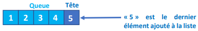
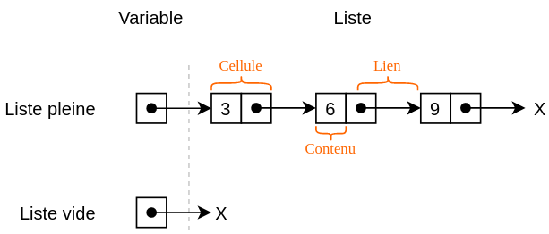

# Thème 3 : Structures linéaires { #lineaires }

<a id="haut"></a>

!!! abstract "Objectif"

    Dans ce chapitre, nous allons étudier différentes structures de données linéaires.

    Nous chercherons notamment à comprendre :

    - ce qu'est une structure de données abstraite ;
    - comment fonctionne une liste ;
    - comment implémenter une liste chaînée ;
    - comment fonctionne une file et le principe FIFO ;
    - comment fonctionne une pile et le principe LIFO ;
    - comment implémenter ces structures à l'aide de classes Python ;
    - comment utiliser une pile pour implémenter une file et inversement.


---

## 1. Les structures linéaires { #structures-lineaires }

!!! note "Structure linéaire"


    Certains algorithmes manipulent des données stockées dans des structures diverses.

    Nous allons voir trois types de structures dites **linéaires** : les listes, les files et les piles.

    Ces structures sont appelées linéaires car il existe un moyen, à partir de n'importe quel élément qui n'est pas le dernier, d'accéder à un « successeur ».


!!! note "Structure de données abstraite"

    Une **structure de données abstraite** (ou SDA) est une représentation d'un ensemble de données ainsi que les opérations qui s'y appliquent.

    La structure est dite abstraite car on n'a pas besoin de savoir comment les données sont représentées, ou comment les opérations sont implémentées.

    Exemple :

    ```python
    class Point:

        def __init__(self):
            """
            initialisation non précisée, on ne connait pas les détails de stockage
            """
            ...

        def translate(self, x, y):
            """
            on ne connait pas l'implémentation de l'opération, mais juste sa spécification
            rôle : déplace le point de x en abscisse et y en ordonnée
            @param x : (int)
            @param y : (int)
            @return : None
            """
            ...
    ```

    La structure `Point` représentée plus haut est une SDA, car on ne sait pas comment sont représentées les données (tuple, tableau, dictionnaire, ...) et on ne sait pas comment les opérations sont implémentées.


---

## 2. Les listes { #listes }

!!! note "Liste"

    Une liste est une structure abstraite de données permettant de regrouper des données sous une forme séquentielle.

    Elle est constituée d'éléments d'un même type, chacun possédant un rang.

    Une liste est évolutive : on peut ajouter ou supprimer n'importe lequel de ses éléments.

    Une liste `L` est composée de deux parties :

    - sa **tête** qui correspond au dernier élément ajouté à la liste ;
    - sa **queue** qui correspond au reste de la liste.

    { width="350" }
 

    Le langage de programmation Lisp (inventé par John McCarthy en 1958) a été un des premiers langages de programmation à introduire cette notion de liste. Lisp signifie *list processing*.

    Voici les opérations pouvant être effectuées sur une liste :

    | Actions | Instruction |
    |---|---|
    | Créer une liste `L` vide | `L = vide()` |
    | Tester si la liste `L` est vide | `estVide(L)` |
    | Ajouter un élément `x` en tête de la liste `L` | `ajouteEnTete(x,L)` |
    | Supprimer la tête `x` d'une liste `L` et renvoyer cette tête `x` | `supprEnTete(L)` |
    | Compter le nombre d'éléments dans une liste `L` | `compte(L)` |
    | Créer une nouvelle liste `L1` à partir d'un élément `x` et d'une liste existante `L` | `L1 = cons(x,L)` |


!!! question "Exercice 1 — Ba-liste-ique"


    **1.** Voici une série d'instructions. Les instructions ci-dessous s'enchaînent. Expliquez ce qui se passe à chacune des étapes :

    ```python 
    L = vide() 
    estVide(L) 
    ajoutEnTete(3,L) 
    estVide(L) 
    ajoutEnTete(5,L) 
    ajoutEnTete(8,L) 
    t = supprEnTete(L) 
    L1 = vide() 
    L2 = cons(8, cons(5, cons(3, L1))) 
    ```

    **2.** Voici une série d'instructions. Les instructions ci-dessous s'enchaînent. Expliquez ce qui se passe à chacune des étapes : 

    ```python 
    L = vide() 
    ajoutEnTete(10,L) 
    ajoutEnTete(9,L) 
    ajoutEnTete(7,L) 
    L1 = vide() 
    L2 = cons(5, cons(4, cons(3, cons(2, cons(1, cons(0,L1)))))) 
    ```

---

## 3. Les listes chaînées { #listes-chainees }


!!! note "Liste chaînée"

    Lorsque l'implémentation de la liste fait apparaître une chaîne de valeurs, chacune pointant vers la suivante, on dit que la liste est une **liste chaînée**. Chaque élément est donc stocké dans un bloc mémoire avec une deuxième information : l'adresse de l'élément suivant. On parle de **maillon**, **cellule** ou encore **node** pour désigner ces blocs.

    { width="350" }

    **Interface :** on dispose, ou souhaite disposer, sur une liste chaînée des méthodes/primitives suivantes : 
    
    - construire une liste vide, souvent nommée `nil` ; 
    - déterminer si la liste est vide (`est_vide`, `is_empty`) ; 
    - insérer un élément en tête de liste (`insert`) ; 
    - récupérer l'élément en tête de liste (`tete`, `head`) ; 
    - récupérer la liste privée de son premier élément, appelée la queue (`queue`, `tail`).

    Ces opérations doivent être réalisées en temps constant.