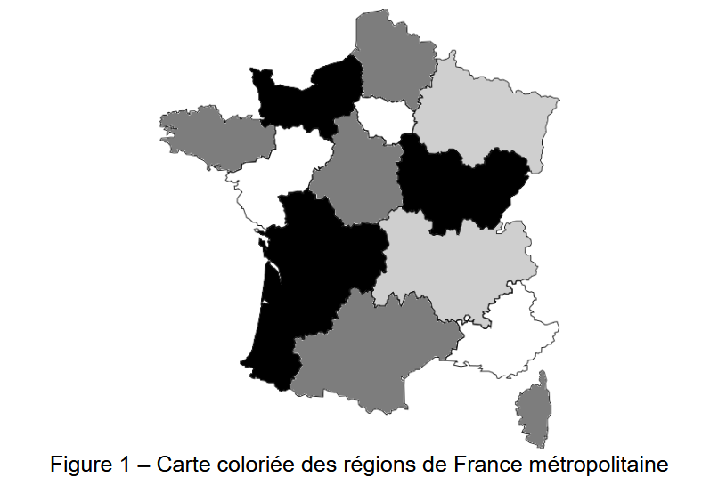

# Thème 1 : Paradigmes de programmation


!!! note "À retenir"

    Un **paradigme de programmation** est une manière de penser et d'organiser un programme.

    Il définit notamment :

    - la façon de représenter les données ;
    - la manière de décrire les traitements ;
    - la structure générale du code.

    Un langage de programmation peut utiliser **plusieurs paradigmes**.

    Par exemple, **Python** permet de programmer selon plusieurs paradigmes :

    - programmation impérative ;
    - programmation orientée objet ;
    - programmation fonctionnelle.

---

!!! abstract "Objectif"

    Dans ce chapitre, nous allons identifier les différences entre ces paradigmes de programmation et comprendre les caractéristiques de chacun.


# Programmation impérative

{ width="350" }

!!! note "À retenir"

    Dans le paradigme impératif, on décrit un programme comme une suite d'instructions qui sont exécutées les unes après les autres.

    Le programme indique donc comment obtenir le résultat, en faisant évoluer progressivement l'état du programme.

    On utilise généralement pour cela : des variables, des affectactions, des structures conditionnelles, des boucles et des fonctions.


Exemple :

On souhaite calculer les carrés des nombres d'une liste.

```python
nombres = [1, 2, 3, 4, 5] 

carres = [] 

for n in nombres: 
    carres.append(n ** 2) 
    
print(carres)
```

Le programme effectue successivement les opérations suivantes :

1. `nombres` contient `[1, 2, 3, 4, 5]`.
2. `carres` est initialisée avec une liste vide : `[]`.
3. La boucle commence avec `n = 1`.
4. Le carré de `1` est calculé : `1 ** 2 = 1`.
5. `1` est ajouté à carres : `[1]`.
6. `n` prend la valeur `2`.
7. Le carré de `2` est calculé : `2 ** 2 = 4`.
8. `4` est ajouté à `carres` : `[1, 4]`.
9. Le processus continue avec `n = 3`, puis `n = 4` et `n = 5`.
10. À la fin, `carres` contient `[1, 4, 9, 16, 25]`.
11. Le résultat est affiché.


L'approche impérative décrit donc les différentes étapes permettant de **modifier progressivement l'état du programme**.


# Programmation fonctionnelle

{ width="350" }

[📥 Support élève du thème 1 (PDF)](01_Paradigmes_fiche_activite_complet.pdf){ .md-button }

## Principe 

!!! note "À retenir"
    La programmation fonctionnelle est un paradigme de programmation qui consiste à construire un programme en utilisant principalement des fonctions et des transformations de données.

    Elle privilégie les transformations de données à l'aide de fonctions et cherche à limiter les modifications de l'état du programme.

Reprenons l'exemple utilisé dans la partie précédente.
Avec une approche fonctionnelle, on peut utiliser map :

Exemple :
```python
nombres = [1, 2, 3, 4, 5]

carres = map(lambda n: n ** 2, nombres)

print(list(carres))
```

L'approche fonctionnelle ne décrit donc pas les différentes étapes de modification d'une liste. Elle décrit plutôt **la transformation que l'on souhaite appliquer aux données**.


## Fonctions pures et effets de bord

Une fonction est dite **pure** si :

- elle donne toujours le même résultat pour les mêmes paramètres ;
- elle ne modifie pas de données extérieures à la fonction.

Exemple :
```python
def carre(x):
    return x ** 2

carre(5) # 25
carre(5) # 25
```

Pour une même valeur de `x`, elle produit toujours le même résultat. Elle ne modifie aucune variable extérieure.

Une fonction produit un **effet de bord** lorsqu'elle provoque une modification ou une action observable en dehors de son calcul.

Par exemple, modifier une variable extérieure :
```python
total = 0

def ajouter(x):
    global total
    total += x
```

L'appel :
```python
ajouter(5)
```

ou effectuer un affichage : 
```python
def afficher_carre(x):
    print(x ** 2)
```

Dans les deux cas, la fonction ne se contente pas de calculer et de retourner une valeur.

!!! note "À retenir"
    En programmation fonctionnelle, on cherche autant que possible à utiliser des **fonctions pures** et à limiter les **effets de bord**.

    Cela rend les fonctions plus faciles à comprendre, à tester et à réutiliser.


## Les fonctions comme objets

En Python, une fonction peut être utilisée comme une donnée.

Elle peut notamment être :

- stockée dans une variable ;
- passée comme argument à une autre fonction.

Exemple :
```python
def carre(x):
    return x ** 2
```

On peut stocker cette fonction dans une variable : 

```python
f = carre

print(f(5)) # renverra 25
```

`f` et `carre` désignent alors la même fonction.

Une fonction peut également être passée comme argument à une autre fonction.

Exemple :

```python
def appliquer(f, x):
    return f(x)
```

On peut alors écrire : 
```python
def carre(x):
    return x ** 2

print(appliquer(carre, 5)) # renverra 25
```

La fonction `appliquer` reçoit `carre` comme argument et l'utilise ensuite sur `5`.

!!! note "À retenir"
    En Python, une fonction peut être manipulée comme une valeur.

    Elle peut notamment être **stockée dans une variable** ou **passée comme argument** à une autre fonction.

    Une **fonction d'ordre supérieur** est une fonction qui reçoit une fonction en argument ou qui renvoie une fonction.

## Les fonctions lambda

Une fonction `lambda` permet de créer rapidement une petite fonction.

La syntaxe est la suivante :
```python
lambda parametre: expression
```

Exemple :
```python
lambda x: x ** 2
```

équivaut à :
```python
def carre(x):
    return x ** 2
```

On peut donc écrire :
```python
f = lambda x: x ** 2

print(f(5)) # renverra 25
```

!!! info "Information"
    Les fonctions `lambda` sont particulièrement utilisées avec `map`, `filter` et `reduce`.

!!! note "À retenir"
    `lambda` permet de définir rapidement une petite fonction, généralement utilisée directement à un endroit précis.

## map : transformer

La fonction `map` permet d'appliquer une fonction à chaque élément d'une collection.

Exemple :
```python
nombres = [1, 2, 3, 4, 5]

carres = map(lambda x: x ** 2, nombres)

print(list(carres)) # [1, 4, 9, 16, 25]
```

On peut lire ce programme ainsi : pour chaque élément de `nombres`, calculer son carré.


## filter : sélectionner

La fonction `filter` permet de conserver uniquement les éléments qui vérifient une condition. La fonction utilisée doit renvoyer `True` ou `False`.

Exemple :
```python
nombres = [1, 2, 3, 4, 5, 6]

pairs = filter(lambda x: x % 2 == 0, nombres)

print(list(pairs)) # [2, 4, 6]
```

On peut lire ce programme ainsi : pour chaque élément, vérifier s'il est pair et conserver uniquement ceux qui le sont.


## reduce : combiner

La fonction `reduce` permet de combiner les éléments d'une collection pour obtenir une seule valeur. Elle se trouve dans le module `functools`.

Exemple :
```python
from functools import reduce

nombres = [1, 2, 3, 4, 5]
somme = reduce(lambda x, y: x + y, nombres)

print(somme) # 15 
```

Le calcul est effectué progressivement :
```
1 + 2 → 3
3 + 3 → 6
6 + 4 → 10
10 + 5 → 15
```

## Combiner filter, map et reduce

Les trois fonctions peuvent être utilisées successivement.

On dispose de : 

```python
nombres = [1, 2, 3, 4, 5, 6]
```

On souhaite :

1. conserver les nombres pairs ;
2. calculer leur carré ;
3. calculer leur somme. 

```python
from functools import reduce

nombres = [1, 2, 3, 4, 5, 6]

pairs = filter(lambda x: x % 2 == 0, nombres)

carres = map(lambda x: x ** 2, pairs)

somme = reduce(lambda x, y: x + y, carres)

print(somme) # 56
```

!!! note "À retenir"
    Une approche fonctionnelle permet d'**enchaîner des transformations** pour obtenir progressivement le résultat souhaité.


## Activité 1 - Programmation fonctionnelle

!!! warning "À ne pas oublier"

    Pensez à répondre aux questions sur la **feuille distribuée en classe**.

On dispose d'un dictionnaire contenant les résultats d'une classe :

```python
notes = {
    "Alice": 15,
    "Baptiste": 8,
    "Chloé": 12,
    "David": 17,
    "Emma": 6,
    "Farid": 14,
    "Gabriel": 19,
    "Hugo": 10,
    "Inès": 13,
    "Jules": 7
}
```

L'objectif est d'analyser ces résultats en utilisant les principes de la programmation fonctionnelle.

On cherchera notamment à utiliser les fonctions `map`, `filter` et `reduce`.

!!! question "Question 1"
    On souhaite sélectionner uniquement les élèves ayant obtenu au moins 10.

    Écrire une fonction `est_admis` qui reçoit un couple `(nom, note)` et renvoie :
    
    * `True` si la note est supérieure ou égale à 10 ;
    * `False` sinon.

    Par exemple :
    ```python
    est_admis(("Alice", 15)) # doit renvoyer True
    ```
    Utiliser ensuite `filter` pour sélectionner les élèves admis.


!!! tip "Coup de pouce"
    `filter` reçoit une fonction et un itérable.

    Il conserve les éléments pour lesquels la fonction renvoie `True`.

    On pourra utiliser `list()` pour obtenir et afficher les éléments de l'objet `filter`.

!!! warning "Attention : les itérateurs sont épuisables"

    `filter` et `map` renvoient des **itérateurs**.

    Un itérateur fournit ses éléments **une seule fois**. Lorsqu'on parcourt tous ses éléments, on dit qu'il est **épuisé**.

    Par exemple :

    ```python
    resultat = filter(est_admis, notes.items())

    print(list(resultat))
    print(list(resultat))
    ```

    Le premier `print` affiche les éléments filtrés, mais le second affiche une liste vide :

    ```text
    [...]
    []
    ```

    En effet, les éléments ont déjà été parcourus par le premier `list()`.

    **Attention donc à ne pas afficher un itérateur avant de vouloir le réutiliser.**

___

!!! question "Question 2"
    On souhaite maintenant récupérer uniquement les noms des élèves admis.

    Écrire une fonction `recuperer_nom` qui reçoit un couple `(nom, note)` et renvoie le nom de l'élève.

    Par exemple :

    ```python 
    recuperer_nom(("Alice", 15)) # doit renvoyer "Alice" 
    ```

    Utiliser ensuite `map` pour appliquer cette fonction aux élèves admis. On souhaite obtenir :

    ```python
    ['Alice', 'Chloé', 'David', 'Farid', 'Gabriel', 'Hugo', 'Inès']
    ```

!!! tip "Coup de pouce"
    `map` reçoit une fonction et un itérable.

    Il applique la fonction à chacun des éléments de l'itérable.

    Comme pour `filter`, on pourra utiliser `list()` pour obtenir les éléments de l'objet `map`.

---

!!! question "Question 3"
    On souhaite maintenant récupérer uniquement les notes des élèves admis.

    Écrire une fonction `recuperer_note` qui reçoit un couple `(nom, note)` et renvoie la note. 
    
    Par exemple : 
    
    ```python 
    recuperer_note(("Alice", 15)) # doit renvoyer 15 
    ``` 
    
    Utiliser `map` pour obtenir la liste des notes des élèves admis. Résultat attendu :

    ```text 
    [15, 12, 17, 14, 19, 10, 13] 
    ```

---

!!! question "Question 4"
    On souhaite maintenant calculer la somme des notes des élèves admis.

    Importer la fonction `reduce` :

    ```python
    from functools import reduce
    ```

    Écrire une fonction `additionner` qui reçoit deux nombres `x` et `y` et renvoie leur somme.

    Utiliser `reduce` pour calculer la somme des notes obtenues à la question précédente.

    Résultat attendu :

    ```text
    100
    ```

!!! tip "Coup de pouce"
    `reduce` reçoit une fonction et un itérable.

    Il applique progressivement la fonction aux éléments de l'itérable afin d'obtenir **une seule valeur**.

---

!!! question "Question 5"
    On souhaite maintenant calculer la moyenne des élèves admis.

    Utiliser : 
    
    * `filter` pour sélectionner les élèves admis ; 
    * `map` pour récupérer leurs notes ; 
    * `reduce` pour calculer leur somme ; 
    * `len` pour connaître leur nombre. 
    
    Le programme doit afficher : 
    
    ```text 
    Nombre d'admis : 7 
    Somme des notes : 100 
    Moyenne : 14.29 
    ```


# Programmation Orientée Objet (POO)

{ width="350" }

[📥 Support élève du thème 1 (PDF)](01_Paradigmes_fiche_activite_complet.pdf){ .md-button }

## Introduction à la POO (Activité débranchée 1)

!!! warning "À ne pas oublier"

    Pensez à répondre aux questions sur la **feuille distribuée en classe**.

## Principe
!!! note "À retenir"
    La programmation orientée objet (POO) est un paradigme de programmation qui consiste à organiser un programme autour d'**objets**.

    Un objet regroupe :

    - des données, appelées **attributs** ;
    - des fonctions, appelées **méthodes**.

Prenons l'exemple d'une voiture, celle-ci possède des caractéristiques, comme un nombre de portes, une couleur, une marque, une vitesse maximale, etc. Cela va donc correspondre aux **attributs** de la classe Voiture. Cette voiture est également capable de se déplacer, de freiner (il vaut mieux), de tourner, etc. Ces actions possibles constituent les **méthodes** de la classe Voiture.

Une classe va donc correspondre à un modèle, une sorte de moule, dont tous les objets qui seront créés avec ce dernier partageront les mêmes attributs et méthodes. Ces objets seront donc du type class en python. Chaque objet créé correspond à une **instance** d'une classe, on utilise par exemple le moule qui correspond à une voiture, puis il ne reste qu'à définir la valeur de ses attributs (ex : Rouge pour la couleur).

## Application

## Exercice 1 - C'est la classe

Soit le programme suivant :

```python
class Ennemi:
    def __init__(self):
        self.point_de_vie = 20
        self.difficulte_ia = "Facile"

    def est_vaincu(self):
        return self.point_de_vie <= 0

    def degats_subis(self, degat):
        self.point_de_vie -= degat

    def mise_a_jour_ia(self):
        if self.point_de_vie < 5:
            self.difficulte_ia = "Difficile"
        elif self.point_de_vie < 13:
            self.difficulte_ia = "Moyenne"

mechant = Ennemi()

degat = 1
while not mechant.est_vaincu():
    mechant.degats_subis(degat)
    mechant.mise_a_jour_ia()
    degat += 1
```

!!! warning "À ne pas oublier"

    Pensez à répondre aux questions sur la **feuille distribuée en classe**.

!!! question "Question 1"
    Identifier le type de la variable `mechant`.

!!! question "Question 2"
    Lister les attributs et méthodes de la classe `Ennemi`.

!!! question "Question 3"
    Quelles sont les valeurs des attributs de l'objet `mechant`à sa création ?

!!! question "Question 4"
    Noter à chaque tour de la boucle, les valeurs des attributs de `mechant`.

---


## Activité 2 - Classe-ment

!!! question "Question 1"
    Implémenter la classe `Ennemi` donnée précédemment. Puis ajouter lui un nouvel attribut nommé `arme`. Cet attribut correspond à un tuple (nom de l'arme, dégât de l'arme).

!!! question "Question 2"
    Ajouter une méthode `prendre_arme` qui met à jour l'arme de l'Ennemi. Cette méthode prend en paramètres un nom d'arme et des dégâts.

!!! question "Question 3"
    Ajouter ensuite une méthode permettant à la classe `Ennemi` de tirer nommée `faire_degat` et qui renvoie les dégâts de l'arme.

!!! question "Question 4"
    Créer deux instances de la classe `Ennemi`. Puis effectuer un tirage aléatoire de valeurs, si la valeur est paire alors c'est le premier ennemi qui tire, réduisant la vie du second. Si la valeur est impaire c'est l'inverse. Réaliser des tirages aléatoires de valeurs jusqu'à la mort d'un des Ennemis et afficher le nombre de points de vie restant du vainqueur.


??? success "Correction"
    [📥 Télécharger la correction de l'activité 2](correction_activite2.py)
---

## Activité 3 - Bot-aille

!!! warning "À ne pas oublier"

    Pensez à répondre aux questions sur la **feuille distribuée en classe**.

On récupère la classe `JeuDeCartes` suivante, les attributs ont été complétés, mais les méthodes non.

```python
class JeuDeCartes:

    def __init__(self):
        """Construit un jeu de 52 cartes."""
        self.cartes = []

        self.valeurs = [
            2, 3, 4, 5, 6, 7, 8, 9, 10,
            "valet", "dame", "roi", "as"
        ]

        self.couleurs = [
            "Pique", "Trèfle", "Carreau", "Coeur"
        ]

        # Création des 52 cartes
        # À compléter (Question 1)
        

    def nomCarte(self, c):
        """Renvoie le nom d'une carte."""
        # À compléter (Question 2)

    def battre(self):
        """Mélange les cartes."""
        # À compléter (Question 3)

    def tirer(self):
        """Retire et renvoie une carte."""
        # À compléter (Question 4)

# À compléter (Questions 5 et 6 )
```

On souhaite simuler le jeu de la bataille, utilisant 52 cartes. On sépare les cartes par ce qu'on appelle les couleurs (Trèfle, Carreau, Pique, Coeur). Chaque carte possède également une valeur (2, 3, 4, 5, 6, 7, 8, 9, 10, Valet, Dame, Roi, As).


!!! question "Question 1"
    Compléter la méthode `init` de la classe `JeuDeCartes`, de façon à ce que l'attribut `cartes` contienne toutes les cartes du jeu. Autrement dit, que la liste contienne tous les tuples (valeur, couleur) possibles afin de représenter les cartes existantes dans un jeu de 52 cartes.

---

!!! question "Question 2"
    Désormais, compléter la méthode `nomCarte` permettant d'afficher le nom d'une carte. (Ex : As de Pique)

---

!!! question "Question 3"
    Compléter la méthode `battre` permettant de mélanger les cartes. Pour cela, utiliser la fonction `shuffle` présente dans la bibliothèque `random`.

---

!!! question "Question 4"
    Compléter la méthode `tirer` permettant de tirer la carte à l'indice 0 et de la supprimer de la liste de l'attribut `cartes`. La méthode retourne le tuple correspondant à la carte. Si toutes les cartes sont tirées, il faudra retourner `None`.

---

!!! question "Question 5"
    Vérifier la méthode `tirer` en retirant toutes les cartes de la liste une par une avec une boucle `for`.

---

!!! question "Question 6"
    Simuler un jeu de bataille entre deux bots (= joueur robot). Le joueur qui remporte le pli gagne un point. 

!!! tip "Conseil"
    Vous avez le droit d'ajouter des méthodes si nécessaire, voire de modifier les attributs de la classe.

---

??? success "Correction"
    [📥 Télécharger la correction de l'activité 3](correction_activite3.py)

---

## Activité 4 - Appartement non meublé


On souhaite modéliser un appartement composé de plusieurs pièces. Une pièce est caractérisée par un **nom** et une **surface** en m². Un appartement est caractérisé par un **nom** et contient une liste de pièces. Compléter les méthodes des deux classes `Piece` et `Appartement`.

```python
class Piece:
    """Représente une pièce d'un appartement."""

    def __init__(self, nom, surface):
        """Initialise une pièce avec son nom et sa surface en m².

        Args:
            nom (str): Nom de la pièce.
            surface (float): Surface de la pièce en m².
        """
        ...

    def getNom(self):
        """Retourne le nom de la pièce.

        Returns:
            str: Nom de la pièce.
        """
        ...

    def getSurface(self):
        """Retourne la surface de la pièce.

        Returns:
            float: Surface de la pièce en m².
        """
        ...

    def setSurface(self, s):
        """Modifie la surface de la pièce.

        Args:
            s (float): Nouvelle surface de la pièce en m².
        """
        ...


class Appartement:
    """Représente un appartement composé de plusieurs pièces."""

    def __init__(self, nom):
        """Initialise un appartement avec une liste de pièces vide.

        Args:
            nom (str): Nom de l'appartement.
        """
        ...

    def getNom(self):
        """Retourne le nom de l'appartement'.

        Returns:
            str: Nom de l'appartement.
        """
        ...

    def ajouter(self, piece):
        """Ajoute une pièce à l'appartement.

        Args:
            piece (Piece): Pièce à ajouter à l'appartement.
        """
        ...

    def nbPieces(self):
        """Retourne le nombre de pièces de l'appartement.

        Returns:
            int: Nombre de pièces.
        """
        ...

    def getSurfaceTotale(self):
        """Calcule et retourne la surface totale de l'appartement.

        Returns:
            float: Surface totale de l'appartement en m².
        """
        ...

    def getListePieces(self):
        """Retourne la liste des pièces de l'appartement.

        Returns:
            list: Liste des instances de Piece.
        """
        ...

```

!!! question "Question 1"
    Compléter la méthode __init__ de la classe `Piece`.
    Elle doit permettre de mémoriser le nom et la surface de la pièce.

---

!!! question "Question 2"
    Compléter les méthodes `getNom` et `getSurface` de la classe `Piece`.

---

!!! question "Question 3"
    Compléter la méthode `setSurface` permettant de modifier la surface d'une pièce.

---

!!! question "Question 4"
    Compléter la méthode __init__ de la classe `Appartement`.
    Un nouvel appartement doit avoir un nom et une liste de pièces vide.

---

!!! question "Question 5"
    Compléter la méthode `getNom` de la classe `Appartement`.

---
!!! question "Question 6"
    Compléter la méthode `ajouter` permettant d'ajouter une pièce à l'appartement.

---
!!! question "Question 7"
    Compléter la méthode `nbPieces` permettant de renvoyer le nombre de pièces de l'appartement.

---
!!! question "Question 8"
    Compléter la méthode `getSurfaceTotale` permettant de calculer la surface totale de l'appartement.

---
!!! question "Question 9"
    Compléter la méthode `getListePieces` permettant de retourner la liste des pièces de l'appartement.

---
!!! question "Question 10"
    Créer un appartement et plusieurs pièces afin de tester les différentes méthodes.

    Vérifier notamment que :

    - les pièces sont correctement ajoutées à l'appartement ;
    - le nombre de pièces est correct ;
    - la surface totale est correctement calculée ;
    - la modification de la surface d'une pièce est prise en compte.


!!! warning "À ne pas oublier"

    Pensez à répondre aux questions sur la **feuille distribuée en classe**.

??? success "Correction"
    [📥 Télécharger la correction de l'activité 4](correction_activite4.py)

---


## Activité 5 - Temps pis


Créer et compléter une classe `Temps` permettant de représenter une durée à l'aide de trois attributs :

- `h` : le nombre d'heures ;
- `m` : le nombre de minutes ;
- `s` : le nombre de secondes.

La classe devra également comporter quatre méthodes :

- `__init__` : initialise les attributs de l'objet ;
- `add` : additionne deux durées et renvoie le résultat ; 
- `sous` : soustrait une durée à une autre et renvoie le résultat ;
- `__repr__` : permet d'afficher une durée sous la forme **« x heures y minutes z secondes »**.


!!! question "Question 1" 
    Écrire la classe `Temps` et compléter la méthode `__init__`.

---

!!! question "Question 2" 
    Compléter la méthode `__repr__` permettant d'afficher une durée sous la forme : 
    ```text 
    2 heures 15 minutes 30 secondes 
    ```
---

!!! question "Question 3" 
    Compléter la méthode `add` permettant d'additionner deux durées. Par exemple : 

    ```python 
    t1 = Temps(2, 15, 30) 
    t2 = Temps(1, 50, 45) 
    t3 = t1.add(t2) 
    ```
    
    `t3` doit alors représenter une durée de 4 heures, 6 minutes et 15 secondes.
    
---

!!! question "Question 4"
    Compléter la méthode `sous` permettant de soustraire une durée à une autre.

    On supposera que la première durée est supérieure ou égale à la seconde.

    Par exemple :

    ```python
    t1 = Temps(4, 30, 20)
    t2 = Temps(1, 45, 50)

    t3 = t1.sous(t2)
    ```

    `t3` doit alors représenter une durée de 2 heures, 44 minutes et 30 secondes.

!!! warning "À ne pas oublier"

    Pensez à répondre aux questions sur la **feuille distribuée en classe**.


??? success "Correction"
    [📥 Télécharger la correction de l'activité 5](correction_activite5.py)

---


## Exercice 2 - Ave César

Dans cet exercice, on étudie une méthode de chiffrement de chaînes de caractères alphabétiques appelée **code de César**.

On considère que les messages à chiffrer sont composés uniquement de lettres majuscules de l'alphabet :

`ABCDEFGHIJKLMNOPQRSTUVWXYZ`

Le chiffrement utilise un nombre entier appelé **clé de chiffrement**. Cette clé détermine le décalage appliqué aux lettres du message.


Soit la classe `CodeCesar` définie ci-dessous:

```python
class CodeCesar:

    def __init__(self, cle):
        self.cle = cle
        self.alphabet = "ABCDEFGHIJKLMNOPQRSTUVWXYZ"

    def decale(self, lettre):
        """Décale une lettre selon la clé de chiffrement."""
        num1 = self.alphabet.find(lettre.upper())

        # Si le caractère n'est pas une lettre de l'alphabet
        if num1 == -1:
            return lettre

        # Application du décalage avec retour au début de l'alphabet
        num2 = (num1 + self.cle) % 26

        return self.alphabet[num2]

```

!!! tip "Coup de pouce"
    On rappelle que la méthode `str.find(lettre)` renvoie l'indice (index) de la lettre dans la chaîne de caractères `str`.

!!! question "Question 1"
    Représenter le résultat d’exécution du code Python suivant :
    ```python
        code1 = CodeCesar(3)
        print(code1.decale("A"))
        print(code1.decale("X"))
    ```

---

La méthode de chiffrement du « code César » consiste à décaler les lettres du message dans l’alphabet d'un nombre de rangs fixé par la clé. Par exemple, avec la clé 3, toutes les lettres sont décalées de 3 rangs vers la droite : le A devient le D, le B devient le E, etc.

!!! question "Question 2"
    Ajouter une méthode `chiffrement(self, texte)` dans la classe `CodeCesar` définie à la question précédente. 
    Cette méthode reçoit en paramètre une chaîne de caractères correspondant au message à chiffrer et retourne le message chiffré. 
    Elle doit utiliser la clé de chiffrement de l'instance et la méthode `decale`.

    Exemple : 
    ```python 
    code1 = CodeCesar(3) 
    print(code1.chiffrement("NSI")) 
    # affiche "QVL" 
    ```

---

!!! question "Question 3"
    Écrire un programme qui :

    * demande de saisir la clé de chiffrement ; 
    * crée un objet de classe `CodeCesar` avec cette clé ; 
    * demande de saisir le texte à chiffrer ; 
    * affiche le texte chiffré en appelant la méthode `chiffrement`.

---

!!! question "Question 4"
    On ajoute la méthode `transforme(texte)` à la classe `CodeCesar` :
    ```python
    def transforme(self, texte):
        self.cle = -self.cle
        message = self.chiffrement(texte)
        self.cle = -self.cle
        return message
    ```
    On exécute la ligne suivante :
    ```python 
    code1 = CodeCesar(10) 
    print(code1.transforme("PSX")) 
    ```
    Que va-t-il se passer ? Expliquer votre réponse.


!!! warning "À ne pas oublier"

    Pensez à répondre aux questions sur la **feuille distribuée en classe**.

??? success "Correction"
    [📥 Télécharger la correction de l'exercice 2](correction_exercice2.py)

## Activité 6 - Problème de colorisation


Un pays est composé de différentes régions. Deux régions sont voisines si elles ont au moins une frontière en commun. L'objectif est d'attribuer une couleur à chaque région de la carte sans que deux régions voisines aient la même couleur, en cherchant à utiliser un nombre de couleurs aussi faible que possible.

L'image ci-dessous (Figure 1) donne un exemple de résultat de colorisation des régions de la France métropolitaine.

{ width="450" }


!!! tip "Rappel"
    On rappelle quelques fonctions et méthodes des tableaux (le type `list` en Python) qui pourront être utilisées dans cet exercice :

    * `len(tab)` : renvoie le nombre d'éléments du tableau `tab` ;
    * `tab.append(elt)` : ajoute l'élément `elt` en fin de tableau `tab` ;
    * `tab.remove(elt)` : enlève la première occurrence de `elt` de `tab` si `elt` est dans `tab`. Provoque une erreur sinon.


!!! warning "Remarque"

    Les deux parties de cet exercice forment un ensemble. Cependant, il n’est pas nécessaire d’avoir répondu à une question pour aborder la suivante. En particulier, on pourra utiliser les méthodes des questions précédentes même quand elles n’ont pas encore été écrites.


### Partie 1

On considère la classe `Region` qui modélise une région d'un pays sur une carte.

Le début de son implémentation est donné ci-dessous :
```python
class Region:
    """Modélise une région d'un pays sur une carte."""

    def __init__(self, nom_region):
        """Initialise une région.

        Paramètre :
            nom_region (str) : nom de la région.
        """
        self.nom = nom_region
        self.tab_voisines = []
        self.tab_couleurs_disponibles = [
            "rouge",
            "vert",
            "bleu",
            "jaune",
            "orange",
            "marron"
        ]
        self.couleur_attribuee = None

```

L'attribut `tab_voisines` contient la liste des régions voisines de la région.

L'attribut `tab_couleurs_disponibles` contient les couleurs qui peuvent encore être attribuées à la région.

Enfin, l'attribut `couleur_attribuee` contient la couleur attribuée à la région. Il vaut `None` lorsqu'aucune couleur ne lui a encore été attribuée.

!!! question "Question 1"
    Donner une instruction permettant de créer une instance nommée `ge` de la classe `Region` correspondant à la région « Grand Est ».

---

!!! question "Question 2"
    On souhaite ajouter à la classe `Region` une méthode `premiere_dispo` qui renvoie la première couleur disponible.

    On supposera que la liste `tab_couleurs_disponibles` n'est pas vide.

    ```python
    def premiere_dispo(self):
        """Renvoie la première couleur disponible.

        Returns:
            str : première couleur disponible.
        """

        return ...
    ```
    Compléter la méthode ci-dessus.


---

!!! question "Question 3"
    On souhaite ajouter à la classe `Region` une méthode `renvoie_nb_voisines` qui renvoie le nombre de régions voisines.

    ```python
    def renvoie_nb_voisines(self):
        """Renvoie le nombre de régions voisines.

        Returns:
            int : nombre de régions voisines.
        """

        return ...
    ```

    Compléter la méthode ci-dessus.

---

!!! question "Question 4"
    On souhaite ajouter à la classe `Region` une méthode `est_colorisee` qui indique si une couleur a été attribuée à la région.

    La méthode renvoie `True` si une couleur a été attribuée et `False` sinon.

    ```python
    def est_colorisee(self):
        """Indique si une couleur a été attribuée à la région.

        Returns:
            bool : True si une couleur est attribuée, False sinon.
        """

        ...
    ```
    Compléter la méthode ci-dessus.

---

!!! question "Question 5"
    On souhaite ajouter à la classe `Region` une méthode `retirer_couleur`.

    Cette méthode reçoit une couleur en paramètre et la retire de la liste des couleurs disponibles si elle s'y trouve.

    Si la couleur n'est pas présente dans la liste, la méthode ne fait rien.

    ```python
    def retirer_couleur(self, couleur):
        """Retire une couleur de la liste des couleurs disponibles.

        Args:
            couleur (str) : couleur à retirer.
        """

        ...
    ```
    Compléter la méthode ci-dessus.

---

!!! question "Question 6"
    On souhaite ajouter à la classe `Region` une méthode `est_voisine`.

    Cette méthode reçoit une région en paramètre et renvoie `True` si cette région est une voisine de la région courante, et `False` sinon.

    ```python
    def est_voisine(self, region):
        """Indique si une région est voisine de la région courante.

        Args:
            region (Region) : région à tester.

        Returns:
            bool : True si la région est voisine, False sinon.
        """

        ...
    ```
    Compléter la méthode ci-dessus.

---

!!! warning "À ne pas oublier"

    Pensez à répondre aux questions sur la **feuille distribuée en classe**.


??? success "Correction"
    { width="350" }
    Bientôt disponible.

---

### Partie 2

Dans cette partie :

- on dispose d'un ensemble d'instances de la classe `Region` pour lesquelles l'attribut `tab_voisines` a été renseigné ;
- on pourra utiliser les méthodes de la classe `Region` écrites dans la partie 1 :
    - `premiere_dispo`
    - `renvoie_nb_voisines`
    - `est_colorisee`
    - `retirer_couleur`
    - `est_voisine`


On considère maintenant une classe `Pays` qui modélise la carte d'un pays composé de plusieurs régions.

Cette classe possède un unique attribut `tab_regions`. Il s'agit d'une liste Python dont les éléments sont des instances de la classe `Region`.


!!! question "Question 7"

    On souhaite ajouter à la classe `Pays` une méthode `renvoie_tab_regions_non_coloriees` qui renvoie la liste des régions du pays auxquelles aucune couleur n'a encore été attribuée.

    ```python
    def renvoie_tab_regions_non_coloriees(self):
        """Renvoie la liste des régions auxquelles aucune couleur
        n'a encore été attribuée.

        Returns:
            list : liste d'instances de la classe Region.
        """

        ...
    ```
    Compléter la méthode ci-dessus.

---

!!! question "Question 8"

    On considère la méthode suivante :

    ```python
    def renvoie_max(self):
        """Renvoie une région non colorisée ayant le plus de voisines."""

        nb_voisines_max = -1
        region_max = None

        for reg in self.renvoie_tab_regions_non_coloriees():
            if reg.renvoie_nb_voisines() > nb_voisines_max:
                nb_voisines_max = reg.renvoie_nb_voisines()
                region_max = reg

        return region_max
    ```

    1. Expliquer dans quel cas cette méthode renvoie `None`.
    2. Dans le cas où cette méthode ne renvoie pas `None`, indiquer les deux particularités de la région renvoyée par rapport aux autres régions non colorisées.

---

!!! question "Question 9"

    Écrire la méthode `colorie` de la classe `Pays` qui permet de coloriser toutes les régions du pays selon l'algorithme suivant :

    - récupérer la région non colorisée qui possède le plus de voisines ;
    - tant que cette région existe :
        - récupérer sa première couleur disponible ;
        - attribuer cette couleur à la région ;
        - pour chaque région voisine, retirer cette couleur de sa liste de couleurs disponibles si elle y est présente ;
        - récupérer à nouveau la région non colorisée qui possède le plus de voisines.

    La méthode s'arrête lorsqu'il n'y a plus de région non colorisée.

    On supposera qu'il reste toujours au moins une couleur disponible pour la région à coloriser.

    Compléter la méthode suivante :

    ```python
    def colorie(self):
        """Colorise toutes les régions du pays."""
        
        ...
    ```
---

!!! warning "À ne pas oublier"

    Pensez à répondre aux questions sur la **feuille distribuée en classe**.


??? success "Correction"
    { width="350" }
    Bientôt disponible.
---


[📥 Résumé de cours du thème 1 (PDF)](feuille_cours.pdf){ .md-button }

---

# Projet POO

## Liste des sujets retenus :

* [Diamant](https://www.regledujeu.fr/diamant/) ;
* [Tetris](https://fr.wikipedia.org/wiki/Tetris) ;
* [Jeu de la Vie](https://fr.wikipedia.org/wiki/Jeu_de_la_vie) ;
* [Echecs](https://fr.wikipedia.org/wiki/R%C3%A8gles_du_jeu_d%27%C3%A9checs) ;
* [Dames](https://fr.wikipedia.org/wiki/Dames).

## Consignes

Par groupes de **2 à 3 élèves**, vous allez concevoir et programmer un jeu en Python **en utilisant le paradigme de la programmation orientée objet (POO)**.

Le jeu devra être **jouable au minimum dans une console**. Les groupes qui le souhaitent pourront aller plus loin en développant une **interface graphique avec la bibliothèque Pyxel**.

L'objectif n'est pas seulement d'obtenir un jeu fonctionnel : vous devrez être capables de concevoir votre programme en utilisant les principes de la POO, de justifier vos choix et d'expliquer votre travail.

## Organisation du travail 

Le travail devra être **réparti entre les membres du groupe**, en fonction des capacités, des connaissances et des points forts de chacun.

Chaque membre doit avoir une contribution réelle et identifiable au projet.

La répartition peut par exemple concerner :

* la conception des classes et de l'architecture du programme ;
* la programmation des règles du jeu ;
* la gestion des joueurs et des interactions ;
* la gestion du plateau ou des éléments du jeu ;
* l'affichage et les interactions avec l'utilisateur ;
* l'interface graphique avec Pyxel ;
* les tests et la correction des erreurs ;
* la rédaction du rapport.

La répartition du travail devra être présentée dans le rapport écrit et pourra être questionnée lors de la soutenance.

!!! warning "Attention"
    Attention : travailler en groupe ne signifie pas que chacun programme uniquement « sa partie » sans comprendre le reste du projet. Chaque membre doit être capable d'expliquer le fonctionnement général du programme.


## Contraintes de programmation

### 1. Utiliser la programmation orientée objet

Le projet doit obligatoirement utiliser le paradigme de la POO.

Vous devrez notamment réfléchir aux :

* classes nécessaires au fonctionnement du jeu ;
* attributs permettant de représenter l'état des objets ;
* méthodes permettant de modifier ou d'exploiter cet état ;
* relations entre les différents objets.

Le nombre de classes n'est pas imposé : il doit être adapté au jeu choisi.

La POO ne doit pas être utilisée uniquement pour respecter la consigne. Elle doit permettre de **structurer réellement le programme**.

Vous devrez être capables de répondre à des questions telles que :

* Quelles sont les classes de votre programme ?
* Pourquoi avez-vous créé ces classes ?
* Quels sont leurs attributs ?
* Quelles sont leurs méthodes ?
* Quels objets sont créés pendant une partie ?
* Comment les objets communiquent-ils entre eux ?
* Pourquoi avoir choisi cette organisation ?

---

### 2. Une version jouable

Le jeu doit être jouable au minimum en console.

La version minimale devra permettre de réaliser une partie ou une simulation complète en respectant les principales règles du jeu.

L'affichage peut rester simple : l'objectif est avant tout de travailler sur la conception et la programmation du jeu.

---

### 3. Interface graphique avec Pyxel


Une interface graphique avec Pyxel pourra être ajoutée au projet.

Elle n'est pas obligatoire si le temps disponible ne permet pas de la réaliser correctement.

Elle pourra notamment permettre :

* d'afficher le plateau ou la zone de jeu ;
* de représenter graphiquement les éléments du jeu ;
* de gérer les interactions avec le joueur ;
* d'afficher les scores ou les informations de partie.

!!! tip "Conseil"
    Commencez par obtenir une **version console fonctionnelle** avant de vous lancer dans l'interface graphique.

---

### Tests et qualité du programme

Votre programme devra être testé avec différentes situations.

Vous devrez notamment rechercher :

* les erreurs de saisie ;
* les situations particulières du jeu ;
* les cas limites ;
* les situations de victoire ou de défaite ;
* les comportements inattendus.

Le programme devra être lisible, organisé et commenté lorsque cela est nécessaire.

Les noms des variables, fonctions, classes et méthodes devront être explicites.

---

## Rapport écrit

Chaque groupe devra produire un rapport présentant le travail réalisé.

Le rapport devra notamment contenir :


### 1. Présentation du jeu

* Nom du jeu ;
* Règles principales ;
* Objectif du joueur.

### 2. Conception du programme

Présenter les principales classes utilisées dans le programme.

Pour chaque classe importante, indiquer :

* son rôle ;
* ses principaux attributs ;
* ses principales méthodes.

Un schéma de conception pourra être utilisé pour représenter les relations entre les différentes classes.

### 3. Choix de programmation

Expliquer quelques choix importants réalisés pendant le développement :

* organisation du programme ;
* représentation des données ;
* choix des classes ;
* gestion des interactions ;
* gestion des règles du jeu.

### 4. Répartition du travail

Indiquer précisément le travail réalisé par chaque membre du groupe.

### 5. Difficultés rencontrées

Présenter les principales difficultés rencontrées et expliquer comment elles ont été résolues.

### 6. Bilan

Présenter :

* ce qui fonctionne ;
* les fonctionnalités éventuellement non terminées ;
* les améliorations qui pourraient être ajoutées.

---

## Soutenance orale

Chaque groupe présentera son projet lors d'une soutenance orale.

La présentation devra permettre de comprendre :

* le fonctionnement du jeu ;
* les choix réalisés ;
* l'organisation du programme ;
* l'utilisation de la POO ;
* la répartition du travail.

Vous devrez également effectuer une démonstration du jeu.

Chaque membre du groupe devra prendre la parole.

Des questions pourront être posées sur le programme afin de vérifier que chaque membre comprend le travail réalisé par le groupe.

---

## Livrables

À la fin du projet, vous devrez rendre :

* le(s) programme(s) Python ;
* le rapport écrit ;
* la présentation orale ;
* éventuellement, une interface graphique Pyxel.

Votre projet devra surtout montrer que vous êtes capables de concevoir un programme suffisamment complexe en utilisant la programmation orientée objet.