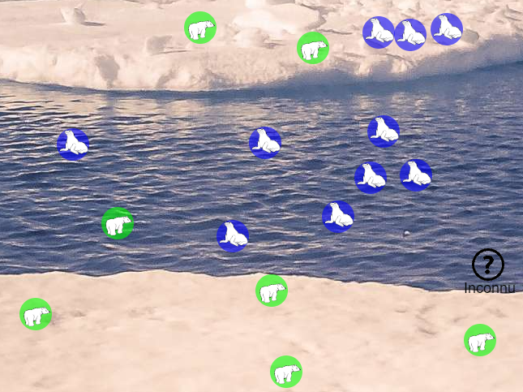

# Terminale NSI

Petit échauffement avant d'attaquer l'année !

{ width="350" }


# Rappels de programmation Python

Les notions à maitriser pour aborder correctement cette année :

- [Bases de la programmation python (variables, types, fonctions)](bases_prog.md)
- [Types construits (listes, dictionnaires, p-uplets)](types_construits.md)


# I. Activité de révision avec l'algorithme des K plus proches voisins (KNN)


[📥 Feuille élève (PDF)](feuille_eleve.pdf){ .md-button }


!!! question "À vous de réfléchir (pas trop longtemps svp)"

    [Lien vers l'animation](https://physalgo.fr/Dariush_KVoisins/index.html)

    Selon vous, il est plus probable que l'animal inconnu présent en bas à droite de l'image et représenté par un '?',  soit un ours ou un phoque ? Selon quel(s) critère(s) ?

    { width="350" }


---

!!! info "Information"
    Cet exemple est représentatif de la nécessité de disposer d'une méthode de classification des motifs. Une réponse a été apportée par la faculté de médecine aéronautique de l'US Air Force dans un rapport publié en 1951, connue depuis sous la règle des k plus proches voisins (Fix \& Hodges, 1951). 

    L’algorithme des k plus proches voisins s’écrit en abrégé k-NN ou KNN, k-nearest neighbors. k est un nombre entier positif généralement petit et impair.
    Il s’agit d’un des algorithmes de machine learning ou "apprentissage machine" qui est essentiel dans le milieu de l’intelligence artificielle.
    Ce genre d’algorithme permet par exemple de prédire le comportement d’une personne en s’intéressant à son milieu. Il peut être utilisé par des géants de la vente comme Amazon ou Netflix afin de vous suggérer un produit (film, musique, etc.). En effet, en disposant de vos données (âge, derniers achats, etc.) et en les comparant à celle d’un client qui a acheté un produit, un algorithme peut tâcher de prédire si vous seriez intéressé ou non par le produit (vous catégoriser).


---

# TP - Algorithme des *k* plus proches voisins (KNN)

!!! abstract "Objectif"

    Dans cette activité, vous allez utiliser l'algorithme des **k plus proches voisins (KNN)** afin de prédire si une zone est susceptible d'abriter une population de renards.

---

## Consignes

!!! warning "À lire avant de commencer"

    - Cette activité s'effectue **en autonomie**.
    - Les fichiers fournis doivent être utilisés et complétés.
    - En cas de difficulté, vous pouvez demander de l'aide à votre professeur.
    - Certains moments de l'activité sont prévus pour faire valider votre travail.

---

## Contexte

Le renard est un animal capable de vivre dans des milieux très variés :

- plaines ;
- montagnes ;
- campagnes ;
- zones périurbaines ;
- villes.

Depuis la **loi Biodiversité de 2016** et l'**arrêté du 3 août 2023**, le renard n'est plus classé comme *« nuisible »*, mais comme *« susceptible d'être nuisible »*.

Afin de mieux connaître sa répartition, on souhaite déterminer si une zone est favorable à la présence de renards à partir de plusieurs caractéristiques.

---

## Les caractéristiques d'une zone

Chaque habitat est décrit par les caractéristiques suivantes, notées sur une échelle de **1 à 10** :

- 🌿 végétation ;
- 💧 proximité de l'eau ;
- 🏙 densité urbaine ;
- 🐭 disponibilité des proies.

Pour les habitats déjà étudiés, une information supplémentaire est connue :

- 🦊 présence ou non d'un renard (`True` ou `False`).

---

## Jeu de données

Les données sont fournies dans le fichier donnees_habitats.py


!!! info "Fichier à télécharger"

    - [📥 Télécharger `donnees_habitats.py`](ece_knn/donnees_habitats.py)


Exemple :

```python
zones_connues = [
    {
        "vegetation": 9,
        "proximite_eau": 6,
        "densite_urbaine": 0,
        "disponibilite_proies": 4,
        "presence_renard": True
    },
    {
        "vegetation": 10,
        "proximite_eau": 5,
        "densite_urbaine": 9,
        "disponibilite_proies": 10,
        "presence_renard": False
    }
]
```

Le fichier **`prediction_habitat.py`** contient plusieurs fonctions à compléter.

!!! info "Fichier à télécharger"

    - [📥 Télécharger `prediction_habitat.py`](ece_knn/prediction_habitat.py)

---

## Distance entre deux habitats

Deux habitats sont comparés grâce à la distance euclidienne :

$$
\delta=\sqrt{(v-v')^2+(p-p')^2+(u-u')^2+(d-d')^2}
$$

où :

- \(v\) : végétation ;
- \(p\) : proximité de l'eau ;
- \(u\) : densité urbaine ;
- \(d\) : disponibilité des proies.

!!! info

    La fonction `sqrt()` est disponible dans le module **math**.

---

## ❓ Question 1

Écrire la fonction **`distance`** qui :

- reçoit deux habitats (dictionnaires) ;
- calcule la distance entre eux ;
- renvoie cette distance.

!!! warning "À ne pas oublier"

    Pensez à répondre aux questions sur la **feuille distribuée en classe**.
    
    Les programmes Python servent uniquement à tester et valider vos réponses.


!!! tip "Conseil"

    Testez régulièrement vos fonctions avant de passer à la question suivante. Un programme correct se construit étape par étape.

--- 

---

## ❓ Question 2

Écrire la fonction **`distance_d_un_habitat`** qui reçoit :

- un habitat ;
- une liste d'habitats.

Elle doit renvoyer une liste de tuples contenant :

- la distance calculée ;
- le dictionnaire représentant l'habitat.

!!! success "Validation"

    Faites valider votre fonction par le professeur avant de poursuivre.

!!! warning "À ne pas oublier"

    Pensez à répondre aux questions sur la **feuille distribuée en classe**.
    
    Les programmes Python servent uniquement à tester et valider vos réponses.

---

## ❓ Question 3

Tester la fonction précédente avec l'habitat `nouveau`.

Afficher les **trois premiers tuples** obtenus.

Les résultats attendus sont du type :

```python
(7.211102550927978,
 {'vegetation': 9,
  'proximite_eau': 6,
  'densite_urbaine': 0,
  'disponibilite_proies': 4,
  'presence_renard': True})

(8.660254037844387,
 {'vegetation': 10,
  'proximite_eau': 5,
  'densite_urbaine': 9,
  'disponibilite_proies': 10,
  'presence_renard': False})

(5.196152422706632,
 {'vegetation': 8,
  'proximite_eau': 5,
  'densite_urbaine': 1,
  'disponibilite_proies': 6,
  'presence_renard': False})
```

!!! success "Validation"

    Faites valider votre affichage par le professeur.

!!! warning "À ne pas oublier"

    Pensez à répondre aux questions sur la **feuille distribuée en classe**.
    
    Les programmes Python servent uniquement à tester et valider vos réponses.

---

## Décision

La fonction **`presence_renard`** renvoie :

- `True` si plus de la moitié des **k** voisins contiennent un renard ;
- `False` sinon.

---

## ❓ Question 4

La fonction **`presence_renard`** contient une erreur dans le traitement des tuples.

Corriger cette fonction.

!!! warning "À ne pas oublier"

    Pensez à répondre aux questions sur la **feuille distribuée en classe**.
    
    Les programmes Python servent uniquement à tester et valider vos réponses.

---

## ❓ Question 5

Déterminer si **l'habitat `nouveau`** est susceptible d'accueillir une population de renards.

Tester plusieurs valeurs de **k** et justifier votre conclusion.

!!! success "Validation"

    Présentez votre réponse au professeur.

!!! warning "À ne pas oublier"

    Pensez à répondre aux questions sur la **feuille distribuée en classe**.
    
    Les programmes Python servent uniquement à tester et valider vos réponses.

---


!!! note "À retenir"

    Un dictionnaire permet de stocker des données sous la forme **clé → valeur**.

    Un dictionnaire est créé avec des accolades :

    ```python
    personne = {
        "nom": "Dupont",
        "age": 17
    }
    ```

    Les valeurs sont accessibles grâce à leur clé :

    ```python
    personne["nom"]
    ```

    renvoie :

    ```text
    Dupont
    ```

---

!!! info "Opérations courantes"

    Ajouter ou modifier une valeur :

    ```python
    personne["ville"] = "Nantes"
    ```

    Supprimer une entrée :

    ```python
    del personne["age"]
    ```

    Tester si une clé existe :

    ```python
    "nom" in personne
    ```

    Parcourir un dictionnaire :

    ```python
    for cle, valeur in personne.items():
        print(cle, valeur)
    ```


---

!!! tip "Conseil"

    Pensez à parcourir la liste avec une boucle `for`.

---

??? question "Afficher un indice"

    Pour trouver le maximum, on peut conserver une variable contenant le meilleur résultat rencontré.

---

??? success "Correction"

    ```python
    def meilleure_note(notes):
        maximum = notes[0]

        for note in notes:
            if note > maximum:
                maximum = note

        return maximum
    ```


!!! abstract "Définition"

    Une base de données est un ensemble organisé de données.


!!! tip "Astuce"

    Utilisez une compréhension de liste pour écrire du code Python plus compact.


!!! warning "Attention"

    Les indices d'une liste commencent à 0 en Python.


!!! danger "Erreur fréquente"

    Ne modifiez pas une liste pendant que vous la parcourez.


!!! success "Objectif atteint"

    La fonction respecte bien la spécification demandée.


!!! question "À vous de réfléchir"

    Quelle est la complexité de cet algorithme ?


!!! example "Exemple"

    ```python
    liste = [1, 2, 3]
    print(liste)
    ```


!!! abstract "Définition"

    Une base de données est un ensemble organisé de données.

!!! note "À retenir"

    Une clé primaire identifie de manière unique un enregistrement.
