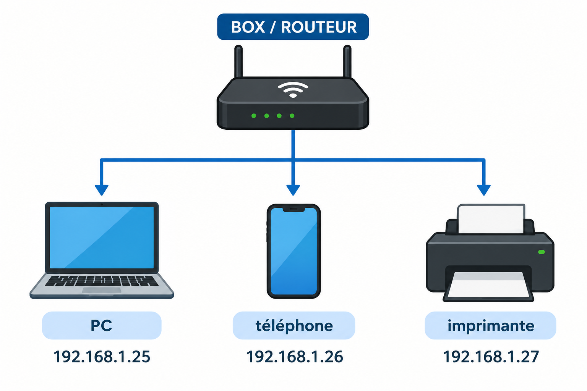
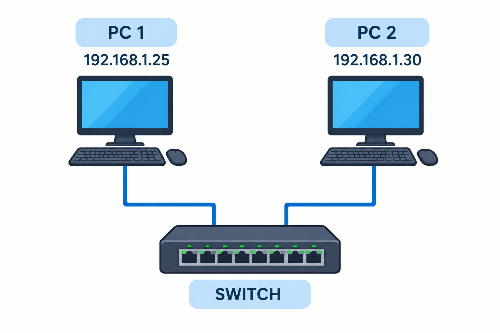
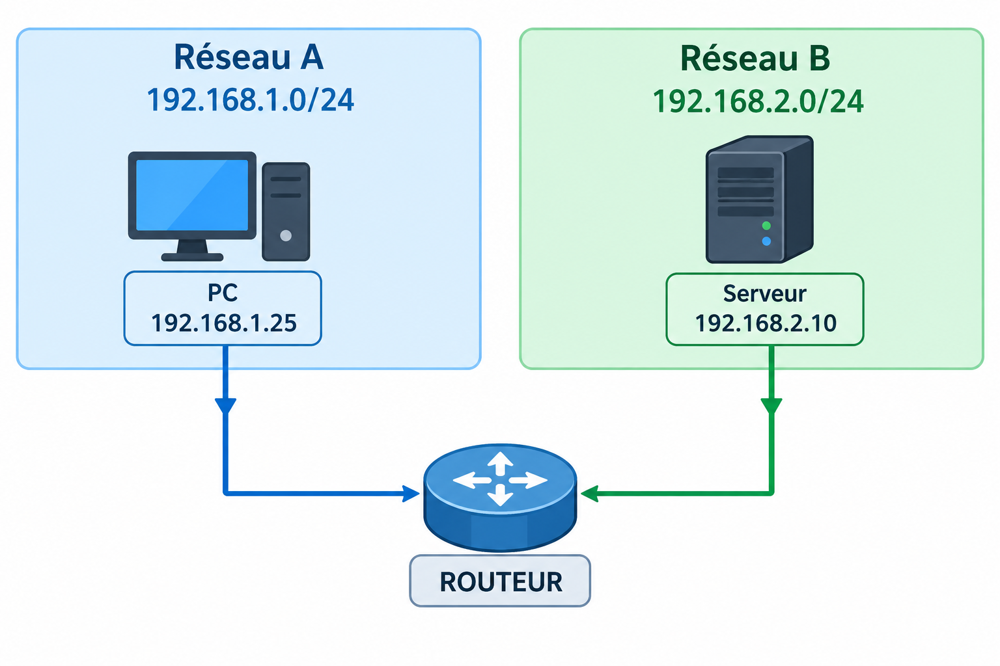
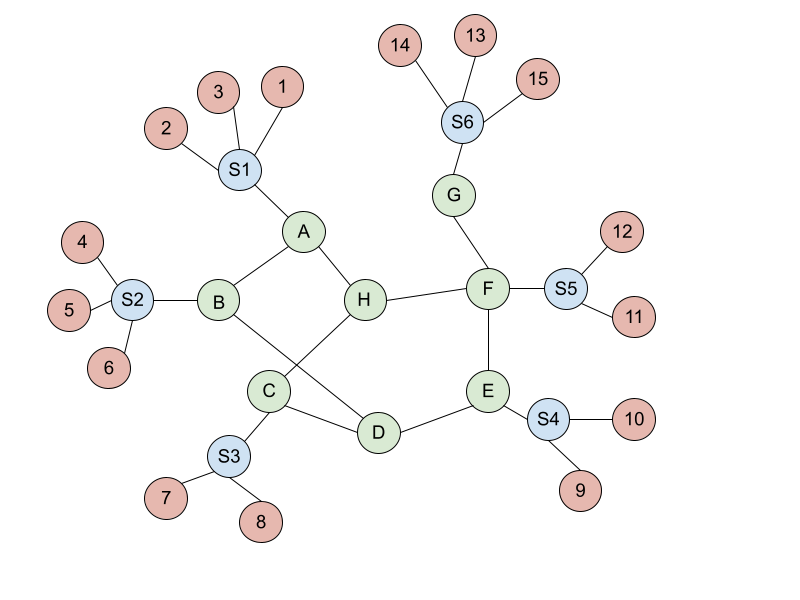
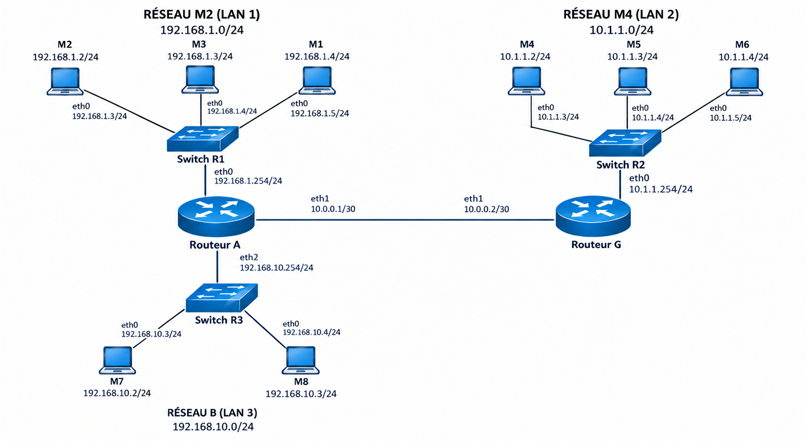
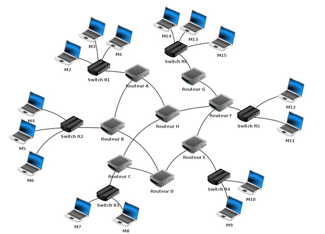
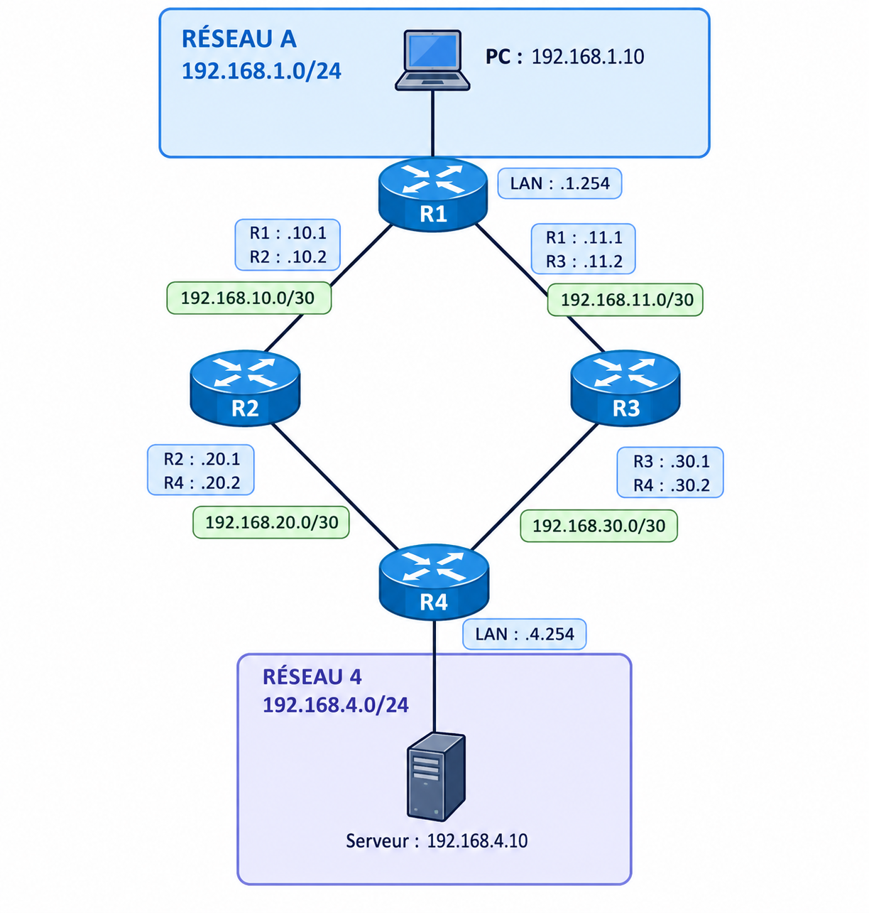
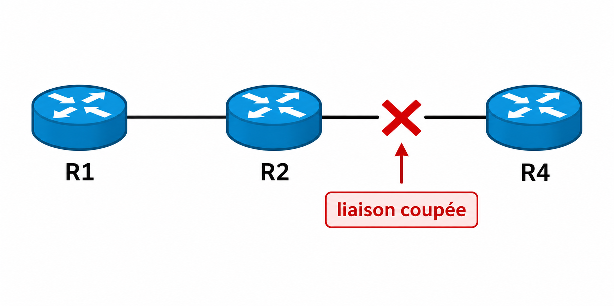
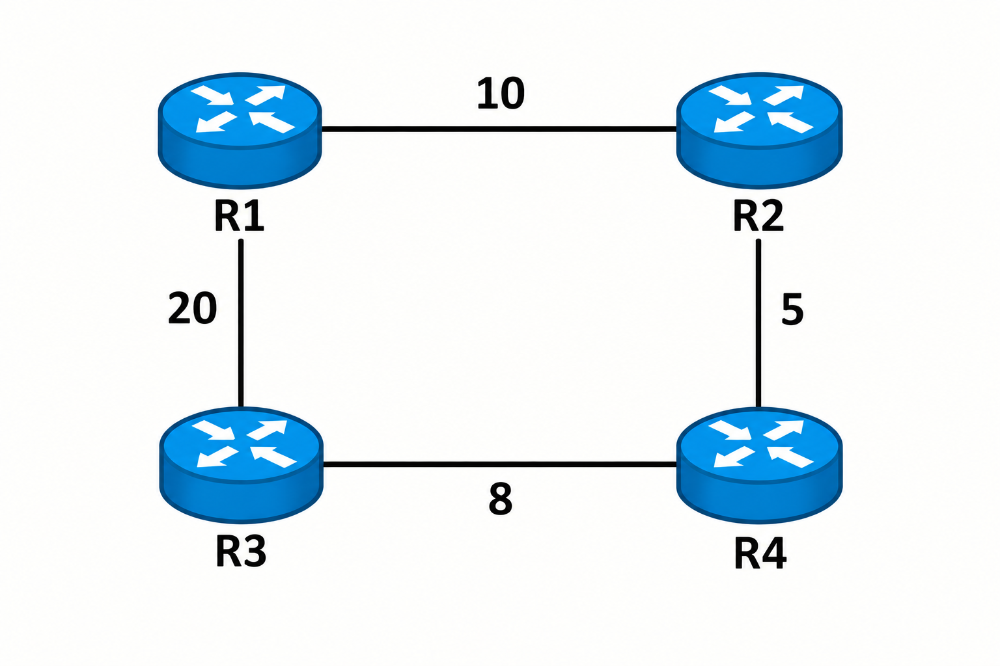

# Thème 2 : Routage et communication entre réseaux { #routage }

<a id="haut"></a>


!!! abstract "Objectif"

    Dans ce chapitre, nous allons comprendre comment un paquet peut être
    transmis d'une machine à une autre à travers plusieurs réseaux.

    Nous chercherons notamment à comprendre :

    - comment un routeur choisit la direction dans laquelle envoyer un paquet ;
    - comment les tables de routage sont construites ;
    - comment les protocoles RIP et OSPF permettent de déterminer des routes ;
    - comment un réseau peut être représenté par un graphe ;
    - quel est le rôle des ports TCP et UDP dans une communication ;
    - comment le NAT permet à plusieurs machines d'un réseau local d'utiliser
      une même adresse IP publique ;
    - comment une machine située derrière un routeur peut être rendue
      accessible depuis Internet.

---

## 1. Rappels : les adresses IP { #adresses-ip }

Avant d'étudier le routage, rappelons quelques notions étudiées au lycée.


!!! question "Exercice 1"
    1. **À quoi servent les adresses IP dans un réseau ? Combien de bits composent une adresse IPv4 ?**

    2. **Quel est le rôle du masque de sous-réseau ? Que permet-il notamment de déterminer à partir d'une adresse IP ?**

    3. **Donner l'écriture décimale du masque suivant : /19**

    4. **Avec un masque /19, combien d'adresses IPv4 sont disponibles dans un sous-réseau ? Combien sont réellement attribuables aux machines ?**

    5. **Quelle est la différence entre une adresse IP privée et une adresse IP publique ? Dans quel cas utilise-t-on chacune ?**

    6. **Quel est le rôle d'un switch et celui d'un routeur dans un réseau ? Quelles adresses utilisent-ils principalement pour acheminer les données ? Quel est le rôle de la passerelle par défaut d'un ordinateur lorsqu'il souhaite communiquer avec une machine située sur un autre réseau ?**


### 1.1 Adresse IPv4


Une adresse IPv4 est codée sur **32 bits**.

Elle est généralement représentée sous la forme de quatre nombres décimaux
séparés par des points.

Par exemple :

```text
192.168.1.25
```

Une adresse IPv4 est donc constituée de 32 bits, répartis en
quatre groupes de 8 bits appelés octets.

Par exemple :

```text
Décimal :    192   .   168    .    1     .    25 
Binaire : 11000000 . 10101000 . 00000001 . 00011001
```

### 1.2 Adresse réseau et masque

Une adresse IP ne permet pas seulement d'identifier une machine.
Elle permet également de déterminer à quel réseau cette machine
appartient.

Pour cela, on utilise un masque de sous-réseau.

Par exemple : 

```text
192.168.1.25/24
```

Le `/24` indique que les 24 premiers bits correspondent à la **partie
réseau** de l'adresse. La notation ici utilisée, est appelée **CIDR**. 

Le masque correspondant à `/24` est : `255.255.255.0`

En binaire : 
```text
11111111.11111111.11111111.00000000
```

Les 24 premiers bits correspondent donc au réseau et les 8 derniers bits permettent d'identifier les machines de ce réseau.

Toutes les machines ayant une adresse comprise dans ce réseau appartiennent au même réseau local. Par exemple :

```text
192.168.1.10/24
192.168.1.25/24
192.168.1.100/24
```
appartiennent toutes au réseau :
```text
192.168.1.0/24
```

!!! note "À retenir"
    Le masque permet de séparer une adresse IP en deux parties :

    - la **partie réseau**, qui indique à quel réseau appartient la machine ;
    - la **partie machine**, qui identifie la machine dans ce réseau.

    Avec `/24`, les **24 premiers bits** représentent le réseau et les **8 derniers bits** représentent la machine.

### 1.3 Quelle est l'adresse IP de mon ordinateur ?

Nous avons parlé des adresses IP comme si chaque ordinateur en possédait une.

Mais quelle est l'adresse IP de notre ordinateur ?

Nous pouvons directement l'observer.

#### Sur Windows

Dans le terminal, on peut utiliser :
```text
ipconfig
```

On obtient notamment une ligne ressemblant à :
```text
Adresse IPv4 . . . . . . . . . . : 192.168.1.25
```

#### Sur macOS

Dans le terminal, on peut utiliser :
```text
ifconfig
```

### 1.4 Adresse IP privée ou publique ?

L'adresse que nous venons de trouver ressemble souvent à :

```text
192.168.1.25
```

Cette adresse est une **adresse IP privée**.

Elle est utilisée à l'intérieur d'un réseau local.

Par exemple, dans une maison :

{ width="350" }

Ces adresses permettent aux appareils de communiquer **à l'intérieur du réseau local**.

Mais comment notre réseau communique-t-il avec Internet ?

La box possède également une **adresse IP publique**.

!!! note "À retenir"
    Une **adresse IP privée** est utilisée dans un réseau local.

    Une **adresse IP publique** permet d'identifier une connexion ou une interface utilisée pour communiquer sur Internet.

    Plusieurs appareils d'un même réseau local peuvent donc utiliser des adresses privées différentes tout en partageant une même connexion à Internet.


### 1.5 Les plages d'adresses privées

Les adresses IPv4 privées ne sont pas choisies au hasard. Certaines plages d'adresses sont réservées à l'utilisation dans les réseaux locaux.

Les principales plages d'adresses IP privées sont :

- **Classe A :** `10.0.0.0` à `10.255.255.255`  
  (utilisée pour les grands réseaux d'entreprise)

- **Classe B :** `172.16.0.0` à `172.31.255.255`  
  (utilisée pour les réseaux de taille moyenne)

- **Classe C :** `192.168.0.0` à `192.168.255.255`  
  (très courante dans les réseaux domestiques)


### 1.6 Communiquer avec une autre machine

Deux machines appartenant au même réseau peuvent communiquer directement à travers le réseau local. Le switch permet d'acheminer les trames entre les machines en utilisant leurs adresses MAC.

{ width="350" }

Les deux machines appartiennent au réseau :
```text
192.168.1.0/24
```

Elles peuvent donc communiquer directement.

En revanche, si une machine souhaite communiquer avec une machine située sur un autre réseau, elle doit passer par un routeur.

{ width="350" }

Le routeur possède une interface dans chacun des deux réseaux.

Il peut donc recevoir un paquet provenant du réseau `192.168.1.0/24` et le transmettre vers le réseau `192.168.2.0/24`.

### 1.7 La passerelle par défaut

Pour communiquer avec une machine située en dehors de son réseau local, un ordinateur doit savoir **à quel routeur transmettre le paquet.**

L'adresse IP de ce routeur est appelée la **passerelle par défaut**.

Par exemple, un ordinateur peut avoir la configuration suivante :

```text
Adresse IP       : 192.168.1.25
Masque           : 255.255.255.0
Passerelle       : 192.168.1.254
```

La passerelle `192.168.1.254` est l'adresse du routeur sur le réseau local.

Si l'ordinateur souhaite communiquer avec `192.168.1.50`, il constate que cette adresse appartient au même réseau que lui `192.168.1.0/24`. Il peut donc communiquer directement avec cette machine.

En revanche, s'il souhaite communiquer avec `192.168.2.10` cette adresse appartient à un autre réseau. L'ordinateur transmet alors le paquet à sa passerelle par défaut.

!!! note "À retenir"
    - Si le destinataire est sur le **même réseau**, la machine peut communiquer directement avec lui.
    - Si le destinataire est sur **un autre réseau**, le paquet doit être envoyé à une **passerelle**, généralement un routeur.
    - Le routeur se charge ensuite de déterminer **vers quel réseau transmettre le paquet**.

    C'est cette dernière fonction qui constitue le **routage**.


---


## 2. Le routage { #routage }

Jusqu'à présent, nous avons vu qu'un ordinateur peut communiquer directement
avec une machine de son réseau et qu'il utilise une passerelle pour
communiquer avec une machine située sur un autre réseau.

Mais que fait réellement le routeur lorsqu'il reçoit un paquet ?

Son rôle est de déterminer **vers où transmettre le paquet** afin qu'il
atteigne son destinataire.

C'est ce que l'on appelle le **routage**.


!!! question "Exercice 2"

    { width="450" }

    1. **Donner tous les chemins possibles pour aller du point 4 au point 7 (sans allers-retours).**
    Exemple de chemin entre 12 et 14 : `12 -> S5 -> F -> G -> S6 -> 14`.

    2. **Donner tous les chemins possibles pour aller du point 1 au point 9 (sans allers-retours).**

    3. **Selon vous, à quoi pourraient correspondre les différentes couleurs si l'on considère le graphe comme étant un réseau informatique ?**

    4. **En considérant qu'il s'agit d'un réseau, entourer les différents réseaux locaux.**


!!! question "Exercice 3"
    { width="600" }

    1. **Sur la figure ci-dessus, entourer les différents réseaux locaux.**

    2. **La machine `172.168.1.3` souhaite envoyer un paquet à la machine `10.4.0.2`. Quel chemin sera emprunté par le paquet ?**

    3. **Pour chaque réseau, indiquer les informations suivantes :**
   
        - adresse du réseau ;
        - nombre d'hôtes possibles sur le réseau ;
        - adresse de diffusion ;
        - première adresse utilisable ;
        - dernière adresse utilisable.

!!! question "Exercice 4"
    { width="600" }

    1. **La machine M1 souhaite envoyer un paquet à la machine M9. À l'aide de la figure ci-dessus, indiquer tous les chemins possibles de la source à la destination (sans aller-retour).**

    2. **Quel(s) paramètre(s) le routeur A pourrait-il prendre en compte pour sélectionner le meilleur chemin afin de transmettre ce paquet ?**

    3. **Comment le routeur A peut-il connaître et mémoriser les différents chemins possibles vers les autres réseaux ?**

    4. **Sous quelle forme le routeur peut-il mémoriser ces informations afin de pouvoir les utiliser pour acheminer les paquets ?**

### 2.1 Le principe du routage

Considérons le réseau suivant :

{ width="450" }

Le PC `192.168.1.10` souhaite communiquer avec le serveur
`192.168.4.10`.

Ces deux machines ne sont pas dans le même réseau :
```text
PC       → 192.168.1.0/24
Serveur  → 192.168.4.0/24
```

Le PC ne peut donc pas envoyer directement le paquet au serveur.

Il doit l'envoyer à son routeur, R1.

R1 doit ensuite déterminer vers quel autre routeur transmettre le paquet.

Il existe ici deux chemins possibles :

```text
Chemin 1 :

PC → R1 → R2 → R4 → Serveur
```

ou :

```text
Chemin 2 :

PC → R1 → R3 → R4 → Serveur
```


!!! note "À retenir"
    Le **routage** permet d'acheminer des paquets entre différents réseaux en déterminant vers quel routeur les transmettre.


### 2.2 La table de routage

Pour effectuer ce travail, chaque routeur possède une **table de routage**.

Cette table contient notamment :

- les réseaux de destination que le routeur connaît ;
- le prochain saut, c'est-à-dire le routeur auquel transmettre le paquet ;
- l'interface par laquelle transmettre le paquet.

Pour notre réseau, R1 peut avoir la table suivante :

| Réseau de destination | Prochain saut  | Interface |
| --------------------- | -------------- | --------- |
| `192.168.1.0/24`      | —              | `eth0`    |
| `192.168.10.0/30`     | —              | `eth1`    |
| `192.168.11.0/30`     | —              | `eth2`    |
| `192.168.4.0/24`      | `192.168.10.2` | `eth1`    |
| `0.0.0.0/0`           | `192.168.11.2` | `eth2`    |


Cette table permet à R1 de prendre une décision en fonction de l'adresse IP de destination du paquet.


### 2.3 Les routes directement connectées

Les trois premières lignes correspondent à des réseaux **directement connectés** à R1 :

```text
192.168.1.0/24
192.168.10.0/30
192.168.11.0/30
```

R1 possède directement une interface dans chacun de ces réseaux.

Par exemple :

- `192.168.1.0/24` est connecté à `eth0` ;
- `192.168.10.0/30` est connecté à `eth1` ;
- `192.168.11.0/30` est connecté à `eth2`.

Le symbole `—` dans la colonne Prochain saut signifie qu'aucun autre routeur n'est nécessaire pour atteindre ces réseaux.

!!! note "À retenir"
    Une **route directement connectée** correspond à un réseau auquel une interface du routeur est directement reliée.

### 2.4 Le prochain saut

Considérons maintenant la ligne :

| Réseau de destination | Prochain saut | Interface |
|---|---|---|
| `192.168.4.0/24` | `192.168.10.2` | `eth1` |

Le réseau `192.168.4.0/24` n'est pas directement connecté à R1.

Pour l'atteindre, R1 doit transmettre le paquet à un autre routeur.

L'adresse `192.168.10.2` est celle de l'interface de **R2** reliée à R1.

On appelle cette adresse le **prochain saut** (*next hop*).

Ainsi, si R1 reçoit un paquet destiné à `192.168.4.10`, il effectue le raisonnement suivant :

```text
Destination : 192.168.4.10
        ↓
Réseau de destination : 192.168.4.0/24
        ↓
Prochain saut : 192.168.10.2
        ↓
Interface de sortie : eth1
```

Le paquet est donc transmis à R2.

!!! note "À retenir"
    Le **prochain saut** est le routeur voisin auquel le routeur actuel transmet le paquet pour poursuivre son trajet.

### 2.5 La route par défaut

La dernière ligne de la table de routage de R1 est :

| Réseau de destination | Prochain saut | Interface |
|---|---|---|
| `0.0.0.0/0` | `192.168.11.2` | `eth2` |

`0.0.0.0/0` correspond à la **route par défaut**.

Elle signifie :
> Si aucune autre route plus précise ne correspond à la destination, utiliser cette route.

Dans notre exemple, R1 transmet alors le paquet à `192.168.11.2`, qui correspond à l'interface de R3.

La route par défaut permet donc à R1 d'envoyer des paquets vers des réseaux pour lesquels il ne possède pas de route plus précise.

!!! note "À retenir"

    `0.0.0.0/0` est la **route par défaut**.

    Elle est utilisée lorsqu'aucune route plus précise ne correspond à la destination.

### 2.6 Suivre un paquet dans le réseau

On peut maintenant suivre le trajet d'un paquet envoyé par le PC
vers le serveur.

Le PC possède l'adresse :
```text
192.168.1.10
```

Le serveur possède l'adresse :
```text
192.168.4.10
```

Le PC sait que le serveur n'appartient pas à son propre réseau
`192.168.1.0/24`.

Il transmet donc le paquet à sa passerelle par défaut :

```text
PC
192.168.1.10
    │
    ▼
R1
192.168.1.254
```

R1 consulte ensuite sa table de routage.

Il trouve :
```text
192.168.4.0/24 → 192.168.10.2 → eth1
```

Il transmet donc le paquet à R2 :
```text
PC → R1 → R2
```

R2 consulte à son tour sa propre table de routage et détermine
comment atteindre `192.168.4.0/24`.

Supposons que R2 transmette le paquet à R4 :
```text
PC → R1 → R2 → R4
```

R4 est directement connecté au réseau `192.168.4.0/24`.
Il transmet alors le paquet au serveur :

```text
PC → R1 → R2 → R4 → Serveur
```

Le chemin complet est donc :
```text
192.168.1.10 → R1 → R2 → R4 → 192.168.4.10
```

!!! note "À retenir"
    À chaque étape, le routeur :

    1. regarde l'adresse IP de destination ;
    2. consulte sa table de routage ;
    3. détermine où transmettre le paquet ;
    4. transmet le paquet au prochain routeur.

    Le processus se répète jusqu'à atteindre le réseau de destination.

---
## 3. Le routage statique { #routage-statique }

### 3.1 Principe

Dans le **routage statique**, les routes sont configurées manuellement par l'administrateur du réseau.

Par exemple, R1 connaît directement :

```text
192.168.1.0/24
192.168.10.0/30
192.168.11.0/30
```

Mais le réseau `192.168.20.0/30` n'est pas directement connecté à R1.

L'administrateur peut donc ajouter une route indiquant :
```text
192.168.20.0/30 → 192.168.10.2
```
Cela signifie :
> Pour atteindre le réseau `192.168.20.0/30`, transmettre le paquet à R2.

La table de R1 contient alors notamment :

| Réseau de destination | Prochain saut  | Interface |
| --------------------- | -------------- | --------- |
| `192.168.1.0/24`      | —              | `eth0`    |
| `192.168.10.0/30`     | —              | `eth1`    |
| `192.168.11.0/30`     | —              | `eth2`    |
| `192.168.20.0/30`     | `192.168.10.2` | `eth1`    |
| `192.168.4.0/24`      | `192.168.10.2` | `eth1`    |
| `0.0.0.0/0`           | `192.168.11.2` | `eth2`    |


!!! note "À retenir"
    Avec le **routage statique**, les routes sont configurées
    manuellement par l'administrateur.


### 3.2 Limites du routage statique

Le routage statique fonctionne bien pour un petit réseau.

Mais lorsque le réseau devient plus important, la configuration peut devenir lourde.

Imaginons qu'un nouveau réseau soit ajouté :
```text
192.168.50.0/24
```

L'administrateur doit configurer les routes nécessaires sur les routeurs concernés.

Si le réseau comporte beaucoup de routeurs et de réseaux, le nombre de routes à configurer devient important.

De plus, si une liaison tombe en panne, une route statique peut devenir inutilisable.

Par exemple :
{ width="350" }

Si R1 utilisait R2 pour atteindre R4, la route peut ne plus fonctionner.

!!! note "À retenir"

    Le routage statique est simple mais devient difficile à maintenir
    lorsque le réseau est important ou évolue fréquemment.


---
## 4. Le routage dynamique { #routage-dynamique }

### 4.1 Principe

Avec le **routage dynamique**, les routeurs échangent automatiquement des informations sur les réseaux qu'ils connaissent.

Ils utilisent pour cela des **protocoles de routage**.

Dans notre réseau, R1 peut par exemple apprendre automatiquement que les réseaux suivants sont accessibles :

```text
192.168.20.0/30
192.168.30.0/30
192.168.4.0/24
```

R1 n'a donc pas besoin que l'administrateur configure manuellement chacune de ces routes.

{ width="450" }

Les routeurs échangent des informations et construisent progressivement une connaissance du réseau.

!!! note "À retenir"
    Avec le **routage dynamique**, les routes peuvent être apprises
    automatiquement grâce aux échanges entre les routeurs.

### 4.2 Apprentissage des routes

Dans notre réseau, R1 connaît directement :
```text
192.168.1.0/24
192.168.10.0/30
192.168.11.0/30
```

Grâce au routage dynamique, R1 peut apprendre l'existence d'autres réseaux.

Par exemple :
```text
192.168.20.0/30
192.168.30.0/30
192.168.4.0/24
```

R1 peut alors construire automatiquement des routes vers ces réseaux.

Si un nouveau réseau est ajouté au réseau, les routeurs peuvent également apprendre cette nouvelle information sans que l'administrateur ait besoin de configurer manuellement chaque route.


### 4.3 Plusieurs chemins possibles

Notre réseau possède plusieurs chemins entre R1 et R4.

Pour atteindre le réseau `192.168.4.0/24`, R1 peut donc utiliser :

```text
R1 → R2 → R4
```

ou :

```text
R1 → R3 → R4
```

Lorsqu'il existe plusieurs chemins possibles, le protocole de routage utilise une **métrique** pour déterminer quel chemin est le plus intéressant.

La métrique dépend du protocole utilisé.

!!! note "À retenir"

    Le routage dynamique permet aux routeurs de découvrir les réseaux
    et de choisir automatiquement des chemins.


---
## 5. Le protocole RIP { #rip }

### 5.1 Principe

**RIP** (*Routing Information Protocol*) est un protocole de routage dynamique.

RIP utilise principalement le **nombre de sauts** (*hop count*) comme métrique.

Un saut correspond au passage par un routeur.

Par exemple :

```text
R1 → R2 → R4
```
correspond à **2 sauts**.

Alors que :

```text
R1 → R3 → R5 → R4
```

correspond à **3 sauts**.

RIP choisira donc le premier chemin.

!!! note "À retenir"

    RIP utilise le **nombre de sauts** comme métrique.

    Un chemin comportant moins de routeurs est considéré comme
    meilleur.


### 5.2 Limites de RIP

RIP est relativement simple, mais cette simplicité entraîne plusieurs limites.

#### **Un nombre de sauts limité**

RIP considère qu'un réseau situé à 16 sauts ou plus est inaccessible.

La métrique maximale utilisable pour une route est donc de 15 sauts.

Cela limite l'utilisation de RIP dans les grands réseaux.


#### **Une métrique très simplifiée**

RIP utilise essentiellement le nombre de routeurs traversés.

Il ne tient donc pas directement compte du débit des liaisons.

Si les deux chemins comportent le même nombre de sauts, RIP peut considérer qu'ils ont le même coût.

Pourtant, une liaison peut être beaucoup plus rapide que l'autre.

RIP ne permet donc pas de choisir un chemin en fonction de la qualité réelle des liaisons.

#### **Une convergence relativement lente**

Lorsqu'une modification intervient dans le réseau, les routeurs doivent échanger de nouvelles informations avant que leurs tables de routage soient mises à jour.

La convergence correspond au moment où les routeurs ont de nouveau une vision cohérente du réseau.

RIP peut donc être moins adapté aux réseaux importants ou aux réseaux dans lesquels la topologie change fréquemment.

!!! note "À retenir"
    Les principales limites de RIP sont :

    - un nombre de sauts limité à **15** ;
    - une métrique très simple ;
    - aucune prise en compte directe du débit des liaisons ;
    - une convergence moins adaptée aux grands réseaux.
---
## 6. Le protocole OSPF { #ospf }

### 6.1 Principe

**OSPF** (*Open Shortest Path First*) est un autre protocole de routage dynamique.

Contrairement à RIP, OSPF ne se contente pas de compter le nombre de routeurs traversés.

Les routeurs OSPF échangent des informations sur les **liaisons du réseau**.

Ils peuvent ainsi construire une représentation de la topologie du réseau.

On peut représenter cette topologie sous la forme d'un graphe :

- les routeurs sont représentés par des sommets ;
- les liaisons entre les routeurs sont représentées par des arêtes ;
- chaque liaison possède un coût.

Par exemple :
{ width="300" }

OSPF cherche alors un chemin dont la somme des coûts est minimale.


!!! note "À retenir"
    OSPF choisit le chemin dont le **coût total est le plus faible**.


### 6.2 Le coût des liaisons

Le coût d'une liaison est appelé métrique OSPF.

Dans une configuration classique, le coût est lié au débit de la liaison.

Plus une liaison est rapide, plus son coût est faible.

Une formule couramment utilisée est :

$$
\text{Coût} =
\frac{\text{bande passante de référence}}
{\text{bande passante de la liaison}}
$$

La bande passante de référence est une valeur configurable dans OSPF.

Par exemple, si on utilise une bande passante de référence de
`100 Mbit/s` :


```text
Liaison de 10 Mbit/s :

Coût = 100 / 10
     = 10
```

Une liaison de `100 Mbit/s` aura alors :
```text
Coût = 100 / 100
     = 1
```
La liaison la plus rapide possède donc ici un coût plus faible.

!!! note "À retenir"
    Dans OSPF, le coût d'une liaison dépend notamment de sa bande passante.

    Plus le coût est faible, plus la liaison est intéressante pour construire une route.


### 6.3 Calcul du coût d'un chemin

Pour déterminer le meilleur chemin, OSPF additionne les coûts de toutes
les liaisons empruntées.

Par exemple, considérons les deux chemins suivants entre R1 et R4 :

```text
Chemin 1 :

R1 ──10── R2 ──5── R4

Coût total = 10 + 5 = 15
```

et :
```text
Chemin 2 :

R1 ──20── R3 ──8── R4

Coût total = 20 + 8 = 28
```

OSPF choisira le chemin dont le **coût total est le plus faible**, ici le chemin 1.

!!! note "À retenir"

    OSPF utilise le **coût des liaisons** pour choisir un chemin.

    Le meilleur chemin est celui dont le coût total est le plus faible.


### 6.4 L'algorithme de Dijkstra

Pour déterminer le meilleur chemin, OSPF utilise l'**algorithme de Dijkstra**.

L'idée générale est de partir d'un routeur et de rechercher progressivement les chemins de coût minimal vers les autres routeurs.

```text
                           4
                    ┌─────────────┐
                    │             │
                    ▼             ▼
                  ┌────┐   3    ┌────┐
              2   │ R2 │────────│ R4 │
          ┌──────►└────┘        └────┘
          │          │             │
          │          │ 5           │ 2
          │          ▼             ▼
       ┌────┐       ┌────┐       ┌────┐
       │ R1 │       │ R5 │───3───│ R7 │
       └────┘       └────┘       └────┘
          │           │             │
          │ 3         │ 2           │ 4
          ▼           ▼             ▼
        ┌────┐────2─┌────┐───────┌────┐
        │ R3 │       │ R6 │       │ R8 │
        └────┘       └────┘       └────┘
          │                         ▲
          └──────────── 6 ──────────┘
```

On cherche le **meilleur chemin de R1 vers R7**.

#### Étape 1 : initialisation

On commence à R1.

Le coût pour atteindre R1 depuis R1 est `0`.

Les voisins directs de R1 sont connus :

- R2 est à un coût de `4` ;
- R3 est à un coût de `2`.

Les autres routeurs sont encore inconnus : on note leur coût `∞`.

| R1 | R2 | R3 | R4 | R5 | R6 | R7 | R8 | Sélectionné |
| --- | --- | --- | --- | --- | --- | --- | --- | --- |
| **0** | 4 | 2 | ∞ | ∞ | ∞ | ∞ | ∞ | **R1** |

On sélectionne ensuite le routeur non sélectionné dont le coût est le plus faible :

```text
R3 : coût 2
```

#### Étape 2 : sélection de R3

Depuis R3, on peut atteindre R4 et R6.

Pour R4 :

```text
R1 → R3 → R4
2 + 2 = 4
```

Pour R6 :

```text
R1 → R3 → R6
2 + 5 = 7
```

Le tableau devient :

| R1 | R2 | R3 | R4 | R5 | R6 | R7 | R8 | Sélectionné |
| --- | --- | --- | --- | --- | --- | --- | --- | --- |
| **0** | 4 | 2 | ∞ | ∞ | ∞ | ∞ | ∞ | **R1** |
| 0 | 4 | **2** | 4 | ∞ | 7 | ∞ | ∞ | **R3** |

Le plus petit coût non sélectionné est maintenant `4`.

On peut sélectionner **R2**.

#### Étape 3 : sélection de R2

Depuis R2, on peut atteindre R4 et R5.

Pour R4 :
```text
R1 → R2 → R4
4 + 3 = 7
```

Mais on connaît déjà un chemin vers R4 de coût `4` :

```text
R1 → R3 → R4
2 + 2 = 4
```

On conserve donc `4`.

Pour R5 :

```text
R1 → R2 → R5
4 + 2 = 6
```

Le tableau devient :

| R1 | R2 | R3 | R4 | R5 | R6 | R7 | R8 | Sélectionné |
| --- | --- | --- | --- | --- | --- | --- | --- | --- |
| **0** | 4 | 2 | ∞ | ∞ | ∞ | ∞ | ∞ | **R1** |
| 0 | 4 | **2** | 4 | ∞ | 7 | ∞ | ∞ | **R3** |
| 0 | **4** | 2 | 4 | 6 | 7 | ∞ | ∞ | **R2** |


Il y a maintenant deux routeurs avec un coût de `4` : R4 et R2.

R2 vient d'être sélectionné. On sélectionne donc **R4**.


#### Étape 4 : sélection de R4

Depuis R4, on peut atteindre R5 et R6.

Pour R5 :

```text
R1 → R3 → R4 → R5
2 + 2 + 2 = 6
```

Le coût reste donc `6`.

Pour R6 :

```text
R1 → R3 → R4 → R6
2 + 2 + 3 = 7
```
Le coût reste donc `7`.


Le tableau devient :

| R1 | R2 | R3 | R4 | R5 | R6 | R7 | R8 | Sélectionné |
| --- | --- | --- | --- | --- | --- | --- | --- | --- |
| **0** | 4 | 2 | ∞ | ∞ | ∞ | ∞ | ∞ | **R1** |
| 0 | 4 | **2** | 4 | ∞ | 7 | ∞ | ∞ | **R3** |
| 0 | **4** | 2 | 4 | 6 | 7 | ∞ | ∞ | **R2** |
| 0 | 4 | 2 | **4** | 6 | 7 | ∞ | ∞ | **R4** |

Le plus petit coût non sélectionné est maintenant `6`.

On sélectionne **R5**.

#### Étape 5 : sélection de R5

Depuis R5, on peut atteindre R7 et R8.

Pour R7 :

```text
R1 → R2 → R5 → R7
4 + 2 + 4 = 10
```

Pour R8 :

```text
R1 → R2 → R5 → R8
4 + 2 + 6 = 12
```

Le tableau devient :

| R1 | R2 | R3 | R4 | R5 | R6 | R7 | R8 | Sélectionné |
| --- | --- | --- | --- | --- | --- | --- | --- | --- |
| **0** | 4 | 2 | ∞ | ∞ | ∞ | ∞ | ∞ | **R1** |
| 0 | 4 | **2** | 4 | ∞ | 7 | ∞ | ∞ | **R3** |
| 0 | **4** | 2 | 4 | 6 | 7 | ∞ | ∞ | **R2** |
| 0 | 4 | 2 | **4** | 6 | 7 | ∞ | ∞ | **R4** |
| 0 | 4 | 2 | 4 | **6** | 7 | 10 | 12 | **R5** |


Le plus petit coût non sélectionné est `7`.

On sélectionne **R6**.

#### Étape 6 : sélection de R6

Depuis R6, on peut atteindre R8.

On avait trouvé :

```text
R1 → R2 → R5 → R8
```

avec un coût de `12`.

Mais en passant par R6 :

```text
R1 → R3 → R4 → R6 → R8
```

on obtient :

```text
2 + 2 + 3 + 2 = 9
```

Le coût de R8 est donc amélioré :

```text
12 → 9
```

Le tableau devient :

| R1 | R2 | R3 | R4 | R5 | R6 | R7 | R8 | Sélectionné |
| --- | --- | --- | --- | --- | --- | --- | --- | --- |
| **0** | 4 | 2 | ∞ | ∞ | ∞ | ∞ | ∞ | **R1** |
| 0 | 4 | **2** | 4 | ∞ | 7 | ∞ | ∞ | **R3** |
| 0 | **4** | 2 | 4 | 6 | 7 | ∞ | ∞ | **R2** |
| 0 | 4 | 2 | **4** | 6 | 7 | ∞ | ∞ | **R4** |
| 0 | 4 | 2 | 4 | **6** | 7 | 10 | 12 | **R5** |
| 0 | 4 | 2 | 4 | 6 | **7** | 10 | 9 | **R6** |

Le plus petit coût non sélectionné est maintenant `9`.

On sélectionne **R8**.

#### Étape 7 : sélection de R8

R8 est le routeur que nous cherchons à atteindre.

Le coût minimal est donc :

```text
9
```

Le tableau devient :

| R1 | R2 | R3 | R4 | R5 | R6 | R7 | R8 | Sélectionné |
| --- | --- | --- | --- | --- | --- | --- | --- | --- |
| **0** | 4 | 2 | ∞ | ∞ | ∞ | ∞ | ∞ | **R1** |
| 0 | 4 | **2** | 4 | ∞ | 7 | ∞ | ∞ | **R3** |
| 0 | **4** | 2 | 4 | 6 | 7 | ∞ | ∞ | **R2** |
| 0 | 4 | 2 | **4** | 6 | 7 | ∞ | ∞ | **R4** |
| 0 | 4 | 2 | 4 | **6** | 7 | 10 | 12 | **R5** |
| 0 | 4 | 2 | 4 | 6 | **7** | 10 | 9 | **R6** |
| 0 | 4 | 2 | 4 | 6 | 7 | 10 | **9** | **R8** |

On peut maintenant arrêter l'algorithme.

#### Retrouver le chemin

Pour retrouver le chemin, on conserve pour chaque routeur le routeur précédent ayant permis d'obtenir son meilleur coût.

Pour R8, le meilleur coût `9` a été obtenu en passant par R6.

On remonte alors le chemin :

```text
R8 ← R6 ← R4 ← R3 ← R1
```

!!! note "À retenir"
    OSPF utilise l'algorithme de **Dijkstra** pour rechercher les chemins de coût minimal.


### 6.5 Que se passe-t-il en cas de panne ?


L'un des avantages du routage dynamique est de pouvoir s'adapter
aux modifications du réseau.

Imaginons que le chemin suivant soit utilisé :

```text
R1 → R2 → R4
```

Si la liaison entre `R2` et `R4` tombe en panne, OSPF détecte la modification de la topologie du réseau.

Il peut alors rechercher un autre chemin, par exemple :
```text
R1 → R3 → R4
```

Le réseau peut donc continuer à fonctionner sans que l'administrateur
ait besoin de modifier manuellement les tables de routage.


!!! note "À retenir"

    Le routage dynamique permet aux routeurs de s'adapter
    aux changements de la topologie du réseau.

### 6.6 Avantages et limites d'OSPF

OSPF présente plusieurs avantages :

- il prend en compte le **coût des liaisons** ;
- il peut choisir le meilleur chemin parmi plusieurs chemins possibles ;
- il s'adapte aux changements de la topologie du réseau ;
- il est adapté aux réseaux importants.


Mais OSPF est également plus complexe que RIP.

Les routeurs doivent échanger et conserver des informations sur la topologie du réseau. Cela nécessite davantage de mémoire et de ressources.

!!! note "À retenir"

    OSPF est plus puissant et plus adapté aux grands réseaux que RIP,
    mais il est également plus complexe.


---
## 7. Les réseaux privés et l'accès à Internet { #reseaux-prives-internet }

Nous avons vu qu'une machine possède généralement une **adresse IP privée**
dans son réseau local.

Mais cette adresse ne peut pas être utilisée directement pour communiquer
sur Internet.

Par exemple, un ordinateur peut avoir l'adresse :

```text
192.168.1.25
```

Cette adresse est une adresse privée.

La box possède quant à elle une **adresse IP publique** qui lui permet de
communiquer avec Internet.

On obtient donc une organisation de ce type :

```text
    Réseau local                         Internet

    PC                                      Serveur
    192.168.1.25                              │
        │                                     │
        ▼                                     │
    ┌──────────────┐                           │
    │     Box      │───────────────────────────┘
    │              │
    │ IP privée    │ 192.168.1.254
    │ IP publique  │ 203.0.113.25
    └──────────────┘
```

Le PC utilise donc son adresse privée pour communiquer avec les machines
de son réseau local.

Pour communiquer avec Internet, il doit passer par la box.

!!! note "À retenir"

    Une machine d'un réseau local utilise généralement une **adresse IP privée**.

    La box possède une **adresse IP publique** pour communiquer avec Internet.

    Il faut donc un mécanisme permettant de faire communiquer les adresses
    privées du réseau local avec Internet.


C'est notamment le rôle du **NAT**.

---
## 8. Le NAT { #nat }

### 8.1 Principe

**NAT** signifie *Network Address Translation*, c'est-à-dire
**traduction d'adresses réseau**.

Le NAT permet à un routeur de modifier les adresses IP lors du passage
d'un réseau à un autre.

Dans un réseau domestique, le routeur peut notamment remplacer
l'adresse IP privée d'une machine par son adresse IP publique.

Par exemple :
```text
    PC
    192.168.1.25
        │
        ▼
    ┌──────────────┐
    │     Box      │
    │              │
    │ Privée :     │
    │ 192.168.1.254│
    │              │
    │ Publique :   │
    │ 203.0.113.25 │
    └──────────────┘
        │
        ▼
     Internet
```

Lorsque le PC envoie un paquet vers Internet, la box peut remplacer
l'adresse IP source privée :

```text
192.168.1.25
```

par son adresse IP publique :
```text
203.0.113.25
```
Le serveur situé sur Internet voit donc la requête comme provenant
de l'adresse publique de la box.

### 8.2 Exemple de traduction

Imaginons que le PC `192.168.1.25` souhaite communiquer avec un serveur
Internet `93.184.216.34`.

Avant le NAT, le paquet peut être représenté ainsi :
```text
    Source      : 192.168.1.25
    Destination : 93.184.216.34
```
La box traduit alors l'adresse source :
```text
    Source      : 203.0.113.25
    Destination : 93.184.216.34
```
Le serveur Internet reçoit donc un paquet provenant de l'adresse publique
de la box.


!!! note "À retenir"

    Le **NAT** permet à un routeur de traduire une adresse IP privée
    en adresse IP publique.

### 8.3 Pourquoi utiliser le NAT ?

Le NAT présente plusieurs intérêts.

Tout d'abord, il permet à des machines utilisant des adresses IP privées
de communiquer avec Internet.

Il permet également à plusieurs machines d'un même réseau local
d'utiliser une même adresse IP publique.

Par exemple :
```text
    PC 1 : 192.168.1.10 ─┐
                         │
    PC 2 : 192.168.1.20 ─┼──► Box ───► Internet
                         │
    PC 3 : 192.168.1.30 ─┘

                    Adresse publique :
                      203.0.113.25
```

Les trois machines utilisent des adresses privées différentes,
mais peuvent partager la même adresse IP publique.

C'est particulièrement important car le nombre d'adresses IPv4 publiques
est limité.

!!! note "À retenir"

    Le NAT permet notamment à plusieurs machines d'un réseau local
    d'accéder à Internet en utilisant une même adresse IP publique.


### 8.4 Le NAT et le retour des paquets

Lorsqu'un PC communique avec un serveur sur Internet, les paquets circulent
dans les deux directions.

La box doit donc être capable de savoir à quelle machine du réseau local
faire parvenir les réponses.

Elle conserve pour cela des informations sur les traductions effectuées.

Par exemple :
```text
    Réseau local                  Internet

    192.168.1.25 ──► Box ───────► Serveur
                       │
                       │
                       ▼
                 203.0.113.25
```
Lorsque le serveur répond, la box peut retrouver la machine à laquelle
la réponse doit être envoyée.

Cette association devient particulièrement importante lorsque plusieurs
machines utilisent simultanément la même adresse publique.

C'est le rôle du **PAT**, que nous allons étudier ensuite.


---
## 9. Le PAT : plusieurs machines avec une seule adresse publique { #pat }

### 9.1 Principe

**PAT** signifie *Port Address Translation*.

Le PAT est une forme de traduction qui utilise également les
**numéros de port** pour différencier les différentes communications.

Cela permet à plusieurs machines du réseau local de partager
une seule adresse IP publique.

Par exemple :
```text
    PC 1
    192.168.1.10:5000
           │
           │
           ▼
       ┌──────────────┐
       │     Box      │
       │              │
       │ 203.0.113.25 │
       └──────────────┘
           ▲
           │
    PC 2
    192.168.1.20:5001
```
La box peut traduire les communications en utilisant différents
ports publics.

Par exemple :
```text
    PC 1
    192.168.1.10:5000
            ↓
    203.0.113.25:6000

et :

    PC 2
    192.168.1.20:5001
            ↓
    203.0.113.25:6001
```
Les deux communications utilisent donc la même adresse IP publique :
```text
    203.0.113.25
```
mais des ports différents.

La box conserve une table de correspondance afin de savoir à quelle machine
locale transmettre les réponses.

### 9.2 Exemple de table PAT

La box peut conserver une table ressemblant à :

| Adresse privée | Port privé | Adresse publique | Port public |
|---|---:|---|---:|
| `192.168.1.10` | `5000` | `203.0.113.25` | `6000` |
| `192.168.1.20` | `5001` | `203.0.113.25` | `6001` |
| `192.168.1.30` | `5002` | `203.0.113.25` | `6002` |

Grâce à cette table, la box sait à quelle machine transmettre
chaque réponse.

!!! note "À retenir"

    Le **PAT** utilise les **numéros de port** pour différencier
    plusieurs communications utilisant la même adresse IP publique.

    Il permet ainsi à plusieurs machines d'un réseau local
    de partager une seule adresse IPv4 publique.

---
## 10. Les ports TCP et UDP { #ports }

### 10.1 Pourquoi utiliser des ports ?

Une adresse IP permet d'identifier une machine sur un réseau.

Mais une machine peut exécuter plusieurs applications simultanément.

Par exemple, un ordinateur peut utiliser en même temps :

- un navigateur Web ;
- une application de messagerie ;
- un jeu en ligne ;
- un serveur Web.

Il faut donc pouvoir identifier **l'application destinataire** d'un paquet.

C'est le rôle des **ports**.

Un port est un numéro compris entre `0` et `65535`.

Une communication TCP ou UDP est donc notamment identifiée par :
```text
Adresse IP + numéro de port
```

Par exemple :
```text
    192.168.1.25:443
```
désigne l'adresse IP `192.168.1.25` et le port `443`.


### 10.2 Les ports TCP

Le protocole **TCP** utilise des numéros de port pour identifier
les applications qui communiquent.

Certains ports sont associés à des services courants.

Par exemple :

| Port | Service |
|---:|---|
| `80` | HTTP |
| `443` | HTTPS |
| `22` | SSH |
| `53` | DNS |

Lorsqu'un navigateur souhaite communiquer avec un serveur Web HTTPS,
il utilise généralement le port `443` du serveur.

On peut alors représenter la communication ainsi :
```text
    Client                         Serveur Web

    192.168.1.25:5000 ──────────► 93.184.216.34:443
```

Le port `5000` peut être choisi temporairement par le client,
tandis que le serveur écoute sur le port `443`.


### 10.3 Les ports UDP

Le protocole **UDP** utilise également des numéros de port.

Par exemple, DNS utilise généralement le port `53`.

```text
    Client                         Serveur DNS

    192.168.1.25:52000 ─────────► Serveur:53
```
TCP et UDP possèdent chacun leur propre espace de ports.

!!! note "À retenir"

    Une adresse IP permet d'identifier une **machine**.

    Un numéro de port permet d'identifier une **application ou un service**
    sur cette machine.

    On peut donc représenter une destination par :

    `adresse IP + port`


---
## 11. La redirection de ports { #port-forwarding }

### 11.1 Le problème

Nous avons vu que le NAT permet aux machines d'un réseau local
d'accéder à Internet.

Mais que se passe-t-il si une personne située sur Internet souhaite
contacter directement un serveur situé dans le réseau local ?

Par exemple :
```text
    Internet
       │
       │
       ▼
    ┌──────────────┐
    │     Box      │
    │ 203.0.113.25 │
    └──────────────┘
       │
       │
       ▼
    Serveur
    192.168.1.100
```

Le serveur possède une adresse privée :
```text
    192.168.1.100
```
Cette adresse n'est pas directement accessible depuis Internet.

Il faut donc indiquer à la box ce qu'elle doit faire lorsqu'elle
reçoit une connexion sur un certain port.

C'est le rôle de la **redirection de port**.


### 11.2 Principe

On peut configurer la box pour rediriger un port public
vers une machine du réseau local.

Par exemple :
```text
    Port public 443
           │
           ▼
    192.168.1.100:443
```
Lorsqu'un paquet arrive sur l'adresse publique de la box
avec le port `443`, la box le transmet au serveur local
`192.168.1.100` sur le port `443`.

On obtient alors :
```text
    Internet

    203.0.113.25:443
            │
            ▼
          Box
            │
            ▼
    192.168.1.100:443
```
!!! note "À retenir"

    Une **redirection de port** permet de rendre accessible depuis Internet
    un service situé sur une machine du réseau local.


### 11.3 Exemple

Supposons qu'un serveur Web soit installé sur :
```text
    192.168.1.100
```
et qu'il écoute sur le port 80.

On peut configurer la box avec la règle :

| Port public | Adresse privée | Port privé |
|---:|---|---:|
| `80` | `192.168.1.100` | `80` |


Une personne située sur Internet peut alors contacter :
```text
    203.0.113.25:80
```
La box transmettra la connexion vers :
```text
    192.168.1.100:80
```

---
## 12. Le pare-feu { #pare-feu }

### 12.1 Principe

Un **pare-feu** (*firewall*) est un dispositif permettant
de contrôler les communications réseau.

Il peut autoriser ou bloquer des communications en fonction
de différentes informations :

- l'adresse IP source ;
- l'adresse IP destination ;
- le protocole utilisé ;
- le numéro de port ;
- le sens de la communication.

Par exemple, un pare-feu peut autoriser :
```text
    Internet → Serveur Web → port 443
```
tout en bloquant :
```text
    Internet → Réseau local → port 22
```

### 12.2 Le pare-feu et la box

Une box peut jouer plusieurs rôles :
```text
    ┌──────────────────────────────┐
    │             BOX              │
    │                              │
    │  Routeur                     │
    │  NAT / PAT                   │
    │  Pare-feu                    │
    │  Redirection de ports        │
    │                              │
    └──────────────────────────────┘
```
Ces fonctions sont différentes mais peuvent être réalisées
par le même équipement.


!!! note "À retenir"

    Un **pare-feu** contrôle les communications réseau
    afin d'autoriser certaines connexions et d'en bloquer d'autres.

---
## 13. Exemple complet : du réseau local à Internet { #exemple-complet-internet }

Nous pouvons maintenant réunir les différentes notions étudiées.

Un ordinateur du réseau local possède :
```text
    Adresse IP : 192.168.1.25
    Passerelle : 192.168.1.254
```
La box possède l'adresse publique :
```text
    203.0.113.25
```
Le PC souhaite consulter un serveur Web :
```text
    93.184.216.34:443
```
Le paquet suit alors plusieurs étapes :

1. le PC constate que le serveur n'appartient pas à son réseau local ;
2. il transmet le paquet à sa passerelle par défaut ;
3. la box effectue une traduction NAT/PAT ;
4. le paquet est envoyé sur Internet avec l'adresse publique de la box ;
5. le serveur reçoit la requête sur le port `443` ;
6. la réponse revient vers l'adresse publique de la box ;
7. la box utilise sa table NAT/PAT pour retrouver le PC à l'origine
   de la communication ;
8. le paquet est transmis au PC.

On peut représenter le trajet ainsi :
```text
    PC
    192.168.1.25:5000
           │
           ▼
       Passerelle
    192.168.1.254
           │
           ▼
          BOX
    203.0.113.25:6000
           │
           ▼
        Internet
           │
           ▼
    93.184.216.34:443
```

!!! note "À retenir"

    Pour communiquer sur Internet, une machine d'un réseau local
    peut utiliser une adresse IP privée et passer par une box
    qui réalise notamment le routage et la traduction d'adresses.

    Les **ports** permettent ensuite d'identifier les applications
    et les services utilisés lors de la communication.