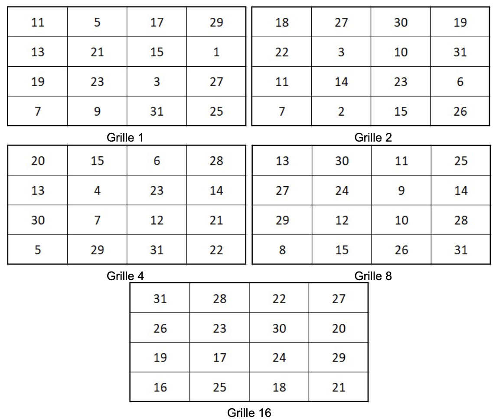

# Thème 1 — 🌐 Internet

{ width="350" }


# Séance 1 — Comment faire communiquer une ville ?

!!! abstract "Projet fil rouge — Montesquéria"
    Bienvenue à **Montesquéria**, une ville du futur.

    Tout au long de l'année, vous allez participer à sa construction et découvrir les technologies qui permettent à ses habitants de communiquer, de s'informer, de se déplacer et d'interagir.

    { width="550" }

---

## Objectifs de la séance

À la fin de cette séance, je dois être capable de :

* comprendre ce qu'est un **réseau informatique** ;
* expliquer pourquoi on relie des ordinateurs entre eux ;
* distinguer un ordinateur **isolé** d'un ordinateur connecté à un réseau ;
* représenter simplement un réseau ;
* comprendre qu'un réseau permet de **faire circuler des informations** ;
* identifier quelques problèmes liés à la communication entre machines.

[📥 Support élève (PDF)](01_Internet_fiche_seance_1.pdf){ .md-button }

!!! warning "À lire avant de commencer"

    - Les fichiers fournis doivent être utilisés et complétés.
    - Certains moments de l'activité sont prévus pour faire valider votre travail.

---

---

# I. Bienvenue à Montesquéria

## 1. La ville du futur

Nous sommes en **2050**.

Montesquéria est une ville entièrement équipée d'ordinateurs.

On trouve notamment :

* 🏫 un lycée ;
* 🏥 un hôpital ;
* 🏛️ une mairie ;
* 📚 une bibliothèque ;
* 🏠 des logements ;
* 🏢 des entreprises ;
* 🚉 une gare ;
* 🚒 une caserne de pompiers.

Chaque bâtiment possède plusieurs ordinateurs.

### Problème

La mairie souhaite pouvoir envoyer rapidement une information à l'hôpital.

Par exemple :

> « Une situation d'urgence vient d'être signalée. »

Mais les deux ordinateurs sont actuellement **isolés**.

```text
🏛️ Mairie                         🏥 Hôpital

💻                                 💻
```

!!! question "Question 1"
    **Comment pourrait-on permettre aux deux ordinateurs de communiquer ?**

    > 💡 Proposez plusieurs solutions.

!!! warning "À lire avant de commencer"

    - Les fichiers fournis doivent être utilisés et complétés.
    - Certains moments de l'activité sont prévus pour faire valider votre travail.


---

## 2. Première solution : relier les ordinateurs

Une première idée consiste à relier directement les deux ordinateurs.

```text
🏛️ Mairie                         🏥 Hôpital

💻 ─────────────────────────────── 💻
```

L'information peut maintenant circuler d'un ordinateur à l'autre.

!!! success "On vient de créer un réseau !"


!!! note "À retenir"
    Un **réseau informatique** est un ensemble d'équipements reliés entre eux afin de pouvoir **échanger des informations**.


---

# II. Et si la ville grandissait ?

La mairie décide maintenant de connecter **toute la ville**.

On souhaite permettre aux différents bâtiments de communiquer :

```text
                         🏥 Hôpital
                              |
                              |
🏫 Lycée ───────────── 🏛️ Mairie ───────────── 📚 Bibliothèque
                              |
                              |
                         🚒 Pompiers
```

!!! question "Question 2"
    **Quel est le problème avec cette organisation si la ville possède 1 000 bâtiments ?**

    Réfléchissez en groupe.

!!! warning "À lire avant de commencer"

    - Les fichiers fournis doivent être utilisés et complétés.
    - Certains moments de l'activité sont prévus pour faire valider votre travail.

---

### 💭 Quelques problèmes possibles

* Il faudrait énormément de câbles.
* Chaque ordinateur devrait être relié à beaucoup d'autres.
* L'installation serait difficile à gérer.
* Si un câble est coupé, certaines communications pourraient ne plus fonctionner.
* Ajouter un nouveau bâtiment deviendrait compliqué.

Il faut donc trouver une meilleure organisation.

---

# III. Une nouvelle idée

Les ingénieurs de Montesquéria proposent une nouvelle solution.

Au lieu de relier directement chaque ordinateur à tous les autres, on va utiliser un **équipement intermédiaire**.

```text
💻 ───────┐
          │
💻 ───────┤
          ├──── 🔲 ──── 💻
💻 ───────┤
          │
💻 ───────┘
```

Toutes les machines sont reliées à cet équipement.

Lorsqu'un ordinateur veut communiquer avec un autre, les informations passent par cet équipement.

!!! question "À vous de réfléchir"
    Quel pourrait être le rôle de cet équipement ?


Cet équipement s'appelle un **switch**.

On parle également de commutateur réseau.

Le switch permet de connecter plusieurs appareils au sein d'un même réseau.

Lorsqu'un appareil envoie des données, le switch les reçoit et les transmet vers l'appareil concerné.

!!! note "À retenir"

    Un **switch** permet de connecter plusieurs appareils **au sein d'un même réseau local**.

---

# IV. Le réseau du lycée

On peut appliquer exactement la même idée à notre établissement.

Imaginons que le lycée possède :

* 35 ordinateurs dans une salle ;
* 20 ordinateurs dans une autre salle ;
* des ordinateurs dans l'administration ;
* des ordinateurs au CDI ;
* des imprimantes ;
* des serveurs.

On ne souhaite évidemment pas relier chaque machine directement à toutes les autres.

On va donc organiser les connexions.

```text
             💻 Ordinateur
                   |
                   |
💻 Ordinateur ──── 🔲 Switch ──── 💻 Ordinateur
                   |
                   |
              🖨️ Imprimante
```

L'équipement central permet de connecter les différentes machines.

!!! question "Question"
    Que se passerait-il si nous ajoutions 100 ordinateurs supplémentaires ?

Le switch permet justement d'ajouter facilement de nouvelles machines au réseau.

!!! note "À retenir"
    Un **réseau local** est un réseau qui relie des équipements situés dans un espace géographique limité, par exemple une maison, un lycée ou un bâtiment.
---

# V. Plusieurs réseaux locaux

Nous savons maintenant construire un réseau local.

Mais Montesquéria possède plusieurs bâtiments.

Il est tout à fait possible que chaque bâtiment possède son propre réseau local.

Nous allons considérer quatre réseaux :

* 🏫 le réseau du lycée ;
* 🏛️ le réseau de la mairie ;
* 🏥 le réseau de l'hôpital ;
* 📚 le réseau de la bibliothèque.

Chaque réseau local ressemble à ceci :
```text                             
      💻                     
      │                      
 💻 ─ 🔲 Switch ─ 💻          
      │                      
      🖥️                                      
```

!!! warning "Attention"
    Ces quatre réseaux sont **distincts**.

    Le réseau du lycée n'est pas le réseau de la mairie.

    Le réseau de la mairie n'est pas celui de l'hôpital.

    Chaque bâtiment possède son propre **réseau local**.


# VI. Comment relier plusieurs réseaux ?

Nous avons maintenant un problème.

Un ordinateur du lycée doit pouvoir communiquer avec un ordinateur de la mairie.

Mais les deux ordinateurs appartiennent à deux réseaux différents.

Le switch permet de connecter des appareils dans un même réseau local.

Il nous faut donc un nouvel équipement.


!!! question "À vous de réfléchir"
    **Comment pourrait-on relier deux réseaux différents ?**

---

## 🔀 Le routeur

Pour relier plusieurs réseaux différents, on utilise un **routeur**.

On peut représenter la situation ainsi :

```text
       RÉSEAU A                         RÉSEAU B

          💻                               💻
          │                                │
          │                                │
     💻 ─ 🔲 ─ 💻                    💻 ─ 🔲 ─ 💻
          │                                │
          │                                │
           └────────── 🔀 ─────────────────┘
                    Routeur
```

Le routeur fait le lien entre les deux réseaux.

Il permet aux informations de passer d'un réseau à un autre.


!!! note "À retenir"
    Un **routeur** est un équipement qui permet de **relier plusieurs réseaux différents** et d'acheminer les informations d'un réseau vers un autre.

    **Switch → à l'intérieur d'un réseau**

    **Routeur → entre plusieurs réseaux**       


# VII. Activité — Construisons le réseau de Montesquéria

!!! abstract "Mission"
    Vous devez maintenant proposer une organisation du réseau informatique de **Montesquéria**.

La ville de Montesquéria possède les bâtiments suivants :

* 🏛️ Mairie ;
* 🏫 Lycée ;
* 🏥 Hôpital ;
* 📚 Bibliothèque ;
* 🚒 Caserne de pompiers ;
* 🚉 Gare ;
* 🏢 Entreprise.

Chaque bâtiment possède au moins un ordinateur.

### Votre mission

Vous devez proposer une organisation permettant à **tous les bâtiments de communiquer**.

### Contraintes

Votre réseau doit :

1. permettre à tous les bâtiments de communiquer ;
2. éviter de relier directement chaque bâtiment à tous les autres ;
3. permettre d'ajouter facilement un nouveau bâtiment ;
4. continuer à fonctionner même si une connexion est coupée.

La quatrième contrainte vous demande de réfléchir au problème rencontré précédemment : que se passe-t-il lorsqu'une connexion est coupée ?

### Travail demandé

Sur votre feuille, représentez votre réseau.

Vous devez faire apparaître :

1. représentez les bâtiments ;
2. représentez les ordinateurs ;
3. représentez les connexions ;
4. ajoutez les équipements intermédiaires que vous jugez nécessaires ;
5. expliquez votre choix.


!!! warning "À lire avant de commencer"

    - Les fichiers fournis doivent être utilisés et complétés.
    - Certains moments de l'activité sont prévus pour faire valider votre travail.

---

# VIII. Et maintenant... Internet 🌍

Nous savons maintenant construire plusieurs réseaux locaux et les relier entre eux.

Mais Montesquéria n'est pas la seule ville du monde.

D'autres villes possèdent elles aussi leurs propres réseaux.

Nous avons commencé avec deux ordinateurs (1er réseau) :

```text
💻 ───────── 💻
```

Puis nous avons construit un réseau permettant de connecter plusieurs ordinateurs :

```text
        💻
        │
💻 ──── 🔲 ──── 💻
        │
        💻
```

Nous pouvons alors créer plusieurs réseaux indépendants :

```text
    RÉSEAU A                    RÉSEAU B

       💻                          💻
       │                           │
💻 ─── 🔲 ─── 💻             💻 ─── 🔲 ─── 💻
       │                           │
       💻                          💻
```


Mais les ordinateurs du réseau A ne peuvent pas communiquer avec ceux du réseau B.

Il faut donc trouver un moyen de relier ces deux réseaux :


```text
    RÉSEAU A                    RÉSEAU B

       💻                          💻
       │                           │
💻 ─── 🔲 ─── 💻             💻 ─── 🔲 ─── 💻
       │                           │
       💻                          💻
        \                         /
         \                       /
          ──────── 🔀 ─────────
                Routeur
```

Nous avons maintenant deux réseaux reliés entre eux.

On peut recommencer avec de nombreux autres réseaux :

```text
             RÉSEAU A
          ┌─────────────┐
          │ 💻 ─ 🔲 ─ 💻 │
          └──────┬──────┘
                 │
                 🔀
              ╱  │  ╲
            ╱    │    ╲
          🔀     🔀     🔀
        │        │        │
    RÉSEAU B  RÉSEAU C  RÉSEAU D
       │         │         │
    💻─🔲─💻   💻─🔲─💻   💻─🔲─💻
```

Nous obtenons progressivement un **réseau de réseaux**.

C'est l'idée fondamentale derrière **Internet**.

!!! note "À retenir"
    **Internet est un réseau mondial qui relie entre eux une multitude de réseaux informatiques.**


---

# IX. Comment faire circuler une information ?

Imaginons que l'ordinateur du lycée veuille envoyer un message à celui de l'hôpital.

```text
🏫 Lycée 💻 - 🔲 -- 🔀 -- 🔲 - 💻 🏥 Hôpital

```

Le message doit parcourir le réseau.

Il peut passer par plusieurs équipements avant d'arriver à destination.

On peut comparer cela au transport d'un colis :

```text
📦
 ↓
Centre de tri
 ↓
Centre de tri
 ↓
Centre de distribution
 ↓
🏠 Destinataire
```

Sur Internet, les informations sont également transportées à travers différents équipements.

!!! note "À retenir"
    Une information peut traverser **plusieurs équipements et plusieurs réseaux** avant d'atteindre son destinataire.


# X. Un problème apparaît... 🚧 

Internet permet maintenant de relier une multitude de réseaux.

Mais un nouveau problème apparaît.

Un nouvel habitant arrive à Montesquéria.

Il utilise son ordinateur et souhaite envoyer un message à la mairie.

```text
💻 Habitant ──── 🔲 ──── 🔀 ──── 🔀 ──── 🏛️ Mairie
```

!!! question "Question 3"
    Comment l'ordinateur de l'habitant sait-il **à quel ordinateur envoyer son message** ?

    Après tout, il y a maintenant des centaines, puis des milliers d'ordinateurs dans la ville.

!!! warning "À lire avant de commencer"

    - Les fichiers fournis doivent être utilisés et complétés.
    - Certains moments de l'activité sont prévus pour faire valider votre travail.

---

## 💭 Imaginez la situation

Si je vous dis :

> « Envoyez ce message à Paul. »

Cela ne suffit probablement pas.

Il faudrait savoir **quel Paul**, où il habite, ou disposer d'une information permettant de l'identifier.

Les ordinateurs rencontrent exactement ce problème.

---

# XI. Donner une identité aux machines 🏷️

Pour pouvoir communiquer correctement, les machines doivent pouvoir être **identifiées**.

On pourrait par exemple imaginer que chaque ordinateur possède un numéro :

```text
Ordinateur de la mairie → 1
Ordinateur de l'hôpital → 2
Ordinateur du lycée → 3
Ordinateur de la bibliothèque → 4
```

On peut alors demander :

> « Envoie le message à la machine numéro 3. »

!!! question "Mais est-ce suffisant ?"


Que se passe-t-il si la ville possède **1 million d'ordinateurs** ?

Comment attribuer ces numéros ?

Comment savoir où se trouve une machine ?

Comment faire pour que les informations trouvent automatiquement leur chemin ?

Il faut donc un système permettant aux machines d'être identifiées et aux informations de trouver leur destination.

Nous verrons la réponse à ce problème lors de la prochaine séance.

---


# XII. Bilan de la séance

## Ce que nous avons découvert

Nous sommes partis d'un problème très simple :

> **Comment faire communiquer deux ordinateurs ?**

Puis nous avons progressivement construit :

```text
Ordinateurs
     ↓
Connexions
     ↓
Réseau
     ↓
Plusieurs réseaux
     ↓
Réseau de réseaux
     ↓
Internet
```

Nous avons également rencontré plusieurs questions :

* Comment identifier une machine ?
* Comment savoir où envoyer une information ?
* Comment faire circuler une information ?
* Comment relier plusieurs réseaux ?
* Que se passe-t-il si une connexion est coupée ?
* Comment un message arrive-t-il au bon destinataire ?

Ces questions vont nous permettre de découvrir progressivement le fonctionnement d'Internet.

---

# 📝 Trace écrite

!!! note "À retenir"
    Un **réseau informatique** est un ensemble d'équipements reliés entre eux afin d'échanger des informations.

    Un **réseau local** relie des équipements situés dans un espace géographique limité, comme une maison, un lycée ou un bâtiment.

    Un **switch** permet de relier plusieurs appareils au sein d'un même réseau local.

    Un **routeur** permet de relier plusieurs réseaux différents.

    **Internet est un réseau mondial de réseaux informatiques.**

    Pour communiquer sur un réseau, les machines doivent notamment pouvoir être **identifiées** et les informations doivent pouvoir être **acheminées vers leur destination**.
---

# Prochaine étape : les adresses IP

Dans la prochaine séance, nous allons résoudre le problème rencontré à Montesquéria :

> **Comment identifier précisément un ordinateur sur un réseau ?**

Nous découvrirons notamment :

* les **adresses IP** ;
* leur représentation ;
* pourquoi elles sont nécessaires ;
* comment les ordinateurs les utilisent pour communiquer.

Et nous verrons que derrière une adresse comme :

```text
192.168.1.42
```

se cache une représentation en **binaire**.

!!! tip "Mission pour la prochaine séance"
    À votre avis, pourquoi utilise-t-on des nombres pour identifier les ordinateurs plutôt que leurs noms ?

---

# Séance 2 — Comment identifier une machine et transmettre des données dans un réseau ?


!!! abstract "Projet fil rouge — Montesquéria"

    Dans la séance précédente, nous avons découvert comment construire des réseaux et comment les relier entre eux.

    Nous avons cependant laissé une question en suspens :

    > **Comment un ordinateur sait-il à quel autre ordinateur envoyer une information ?**

    Aujourd'hui, nous allons découvrir le système utilisé pour identifier les machines sur Internet : **les adresses IP**

---

## Objectifs de la séance

À la fin de cette séance, je dois être capable de :

* expliquer ce qu'est une adresse IP ;
* expliquer pourquoi elle est nécessaire ;
* reconnaître une adresse IPv4 ;
* comprendre comment une machine utilise l'adresse IP d'une autre machine pour lui envoyer des données.

[📥 Support élève (PDF)](01_Internet_fiche_seance_2.pdf){ .md-button }

!!! warning "À lire avant de commencer"

    - Les fichiers fournis doivent être utilisés et complétés.
    - Certains moments de l'activité sont prévus pour faire valider votre travail.

---


# I. Le problème de Montesquéria

Revenons à notre ville.

Dans la séance précédente, nous avons appris que les différents réseaux de Montesquéria peuvent être reliés entre eux.

Imaginons maintenant que l'ordinateur du lycée souhaite envoyer un message à celui de l'hôpital.

```text
🏫 Lycée                         🏥 Hôpital

💻 ─── 🔲 ─── 🔀 ─── 🔀 ─── 🔲 ─── 💻
```

Le message doit traverser plusieurs équipements.

Mais un problème apparaît :

!!! question "Question 1"
    **Comment l'ordinateur du lycée sait-il que le message doit aller jusqu'à l'ordinateur de l'hôpital ?**

    Comment pourrait-il indiquer précisément **quel ordinateur est le destinataire** ?

---

💭 Une comparaison avec le courrier

Imaginez que vous vouliez envoyer une lettre.

Si l'on précise uniquement le prénom de la personne sur la lettre, cette dernière ne pourra pas atteindre son destinataire avec un service de courrier classique.

Il faut donc une information permettant d'identifier précisément le destinataire.

Par exemple : 


```text
Nom Prénom
Numéro Rue
Code postal
Ville
```

Sur Internet, les ordinateurs rencontrent un problème similaire.

Ils ont besoin d'une adresse permettant d'identifier le destinataire.

---

# II. L'adresse IP

Pour communiquer sur Internet, les machines utilisent notamment des adresses IP.

Par exemple :

```text
192.168.1.42
```

On peut faire une analogie :
```text
Courrier                    Internet

🏠 Adresse postale          🏷️ Adresse IP
        ↓                          ↓
   Destinataire                Machine
```

Lorsqu'un ordinateur veut envoyer des données à une autre machine, il doit notamment connaître l'adresse IP de destination.

!!! note "À retenir"
    Une **adresse IP** permet d'identifier une interface réseau et de désigner une destination pour les communications utilisant le protocole IP.

# III. À quoi ressemble une adresse IP ?

Nous allons commencer par IPv4, la version que nous allons utiliser dans cette séance.

Une adresse IPv4 est composée de quatre nombres séparés par des points. Chaque nombre est compris entre 0 et 255.

Quelques exemples d'adresses valides :

```text
10.0.0.1

172.16.5.20

192.168.1.42
```

!!! question "Question 2"
    **Parmi les propositions suivantes, lesquelles peuvent être des adresses IPv4 ?**

    A. 192.168.1.42

    B. 10.0.0.1

    C. 192.168.300.12

    D. 172.16.5

    E. 8.8.8.8

    Justifiez votre réponse.

---

!!! note "À retenir"
    Une adresse **IPv4** est composée de **4 nombres**, séparés par des points.

    Chaque nombre peut aller de **0 à 255**.


# IV. Pourquoi les ordinateurs utilisent-ils des nombres ?

Les ordinateurs manipulent les informations sous forme de bits.

Un bit peut prendre deux valeurs : 0 ou 1.

Les ordinateurs utilisent donc naturellement le système binaire. 
Nous pouvons donc représenter chaque nombre d'une adresse IPv4 en binaire.

Par exemple :
```text
192.168.1.42
```
devient :
```text
11000000.10101000.00000001.00101010
```

# V. Un peu de binaire

## Abracadabra

{ width="550" }

## Comment ça fonctionne ?

Pour comprendre cette représentation, observons les valeurs associées aux positions d'un nombre binaire sur 8 bits :
```text
128   64   32   16    8    4    2    1
```

Prenons :
```text
00101010
```

On obtient :
```text
0x128 + 0x64 + 1x32 + 0x16 + 1x8 + 0x4 + 1x2 + 0x1
```

Donc :
```text
32 + 8 + 2 = 42
```

Ainsi :
```text
00101010₂ = 42₁₀
```

!!! note "À retenir"
    Un nombre d'une adresse IPv4 peut être représenté en **binaire**.

    Chaque partie d'une adresse IPv4 utilise **8 bits**, soit un **octet**. Il y a 4 octets, une adresse IPv4 contient donc :

    **4 × 8 = 32 bits.**


!!! question "Question 3"

    **CConvertissez les nombres suivants de la base 10 vers la base 2 (binaire).**

    ```text
    1   → ______________________________

    3   → ______________________________

    6   → ______________________________

    9   → ______________________________

    12  → ______________________________

    18  → ______________________________

    37  → ______________________________

    75 → ______________________________

    150 → ______________________________

    240 → ______________________________
    ```
---


!!! question "Question 4"

    **Convertissez les nombres suivants de la base 2 vers la base 10. **

    ```text
    00000001 → ______________________

    00000010 → ______________________

    00001010 → ______________________

    00001111 → ______________________

    00101010 → ______________________

    01100100 → ______________________

    11000000 → ______________________

    11111111 → ______________________
    ```


---

!!! question "Question 5"
    Convertissez l'adresse IPv4 suivante en binaire :
    192.168.1.10

    Complétez : 

    192  → 

    168  → 

    1    → 

    10   → 

    L'adresse complète devient :
   
# VI. Adresse source et adresse destination

Lorsqu'un ordinateur communique avec un autre, il faut savoir :

* qui envoie les données ;
* à qui elles sont destinées.

On utilise donc notamment deux adresses :
```text
Adresse source -> ÉMETTEUR        Adresse destination -> DESTINATAIRE
```

Par exemple : 
```text
🏫 Lycée
192.168.1.10

      │
      │ 📦 Données
      ▼

🏥 Hôpital
192.168.3.20
```

On peut représenter le message ainsi :
```text
┌─────────────────────────────────────┐
│ DONNÉES                             │
│                                     │
│ Source      : 192.168.1.10          │
│ Destination : 192.168.3.20          │
└─────────────────────────────────────┘
```

!!! note "À retenir"
    Lors d'une communication, on retrouve notamment :

    **Adresse source** → la machine qui envoie les données.

    **Adresse destination** → la machine vers laquelle les données sont envoyées.

---

# VII. Deux protocoles essentiels : TCP et IP


Nous savons maintenant qu'une communication contient notamment :

- une **adresse IP source** : celle de l'expéditeur ;
- une **adresse IP destination** : celle du destinataire.

Le protocole **IP** permet donc d'indiquer **où envoyer les données** et de participer à leur acheminement à travers les réseaux.

Mais il reste un problème...


!!! question "Question"

    Imaginez que le lycée envoie un fichier à l'hôpital.

    Le fichier est assez volumineux et doit être envoyé en plusieurs morceaux.

    **Comment être sûr que tous les morceaux arrivent bien à destination et dans le bon ordre ?**

---

Pour répondre à ce problème, Internet utilise notamment un autre protocole : **TCP**.

TCP s'occupe de la **fiabilité de la communication** entre l'expéditeur et le destinataire.

Lorsqu'un fichier est envoyé, les données peuvent être transmises en plusieurs morceaux.


```text
📄 FICHIER
     │
     ├── 📦 morceau 1
     ├── 📦 morceau 2
     ├── 📦 morceau 3
     └── 📦 morceau 4
```

Chaque morceau est transmis à travers le réseau.

Mais Internet n'est pas un système parfait : un morceau peut être perdu ou ne pas arriver correctement.

Par exemple :
```text
📦 1 ────────→ ✅
📦 2 ────────→ ❌
📦 3 ────────→ ✅
📦 4 ────────→ ✅
```

Le morceau 2 n'est pas arrivé correctement. Le destinataire va indiquer à l'expéditeur les données qu'il a bien reçues, c'est le principe **d'accusé réception**.

```text
📦 1 ───────────────────────────────→ ✅
📦 2 ───────────────────────────────→ ❌
📦 3 ───────────────────────────────→ ✅
📦 4 ───────────────────────────────→ ✅

              ← « J'ai reçu 1, 3 et 4.
                 Il me manque 2. »

📦 2 ───────────────────────────────→ ✅
```

TCP permet ainsi de détecter les données qui n'ont pas été reçues et de demander leur retransmission.

Une fois les données reçues, TCP permet également de les remettre dans le bon ordre.


!!! note "À retenir"
    **TCP permet d'assurer une transmission fiable des données.**

    Il permet notamment :

    - de suivre les données transmises ;
    - de détecter les données manquantes ;
    - de demander leur retransmission ;
    - de remettre les données dans le bon ordre.    
---

!!! question "Question 6"
    Associez chaque élément à son rôle.

    **A. IP**

    **B. TCP**

    **C. Adresse IP destination**

    **D. Routeur**

    1. ______ Indique le destinataire des données.

    2. ______ Permet de gérer la fiabilité de la transmission.

    3. ______ Permet d'acheminer les données entre différents réseaux.

    4. ______ Utilise les adresses IP pour participer à l'acheminement des données.


---

# 📝 Trace écrite

!!! note "À retenir"
    Pour communiquer sur Internet, les données doivent pouvoir être **adressées**, **acheminées** et **transmises de manière fiable**.

    Une **adresse IP** permet notamment de désigner la source et la destination d'une communication.

    Le protocole **IP** utilise ces adresses pour permettre l'acheminement des paquets.

    Le protocole **TCP** permet d'assurer une transmission fiable des données, notamment en gérant leur réception, leur ordre et leur retransmission en cas de problème.

    Les **routeurs** permettent aux paquets de passer d'un réseau à un autre.

---

# Prochaine étape — Comment retenir toutes ces adresses ?

Nous savons maintenant qu'un ordinateur peut communiquer avec un autre grâce notamment aux adresses IP.

Mais imaginons que nous voulions accéder au serveur du site de Montesquéria.

Faudrait-il vraiment retenir une adresse comme :
```text
192.168.1.42
```

Et si le site possède une autre adresse IP demain ?

Les humains préfèrent utiliser des noms faciles à retenir :
```text
www.montesqueria.fr
```

Dans la prochaine séance, nous allons résoudre le problème rencontré à Montesquéria :

> **Comment Internet fait-il pour retrouver l'adresse IP correspondant à un nom comme `www.montesqueria.fr` ?**

Nous découvrirons notamment :

* Ce qu'est un nom de domaine ;
* Le rôle du DNS ;

